# Oracle Advanced Security - Transparent Data Encryption

## Lab 100: ENCRYPTING A TABLESPACE

#### Overview

- In this lab exercise, you will accomplish the following:
     - Validate the status of the encryption keys using Oracle Enterprise    Manager  Cloud Control
     - OFFLINE the EMPLOYEESEARCH_DATA tablespace
     - Convert the existing tablespace to an encrypted tablespace 
     - Verify that encryption has taken place
    
- After the Start_OAS_Infrastructure.sh script finishes (see the steps at the end of the section B), open the Database_Security_Labs folder on the Oracle Linux Desktop, and navigate to the Oracle_Advanced_Security folder.

  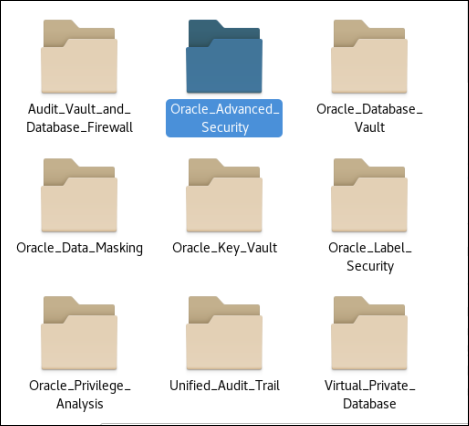

- Open Oracle_Advanced_Security_Lab_Exercise_01 folder.

  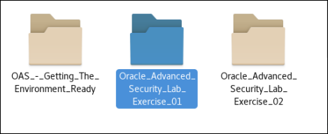
  
- In the Oracle_Advanced_Security_Lab_Exersice_01 foler, click the 01_Search_Strings_Plain_Text.sh to verify if there is unencrypted data in the the datafile. We are able to view the sensitive data in the datafile. It will look similar to the screenshot

  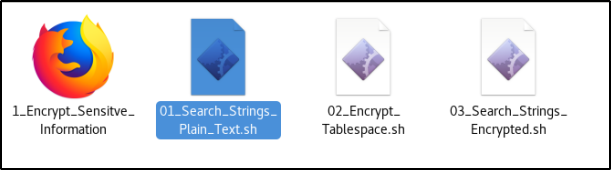

  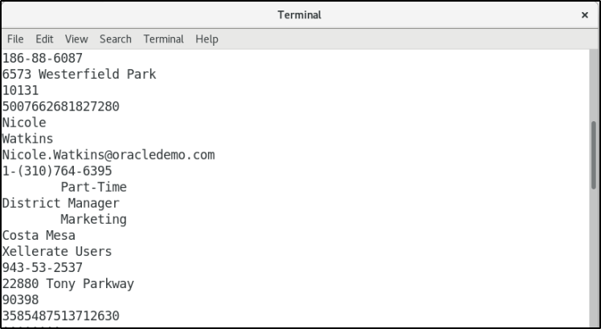

- Now open the 01_Encrypt_Sensitive_Information browser shortcut.

  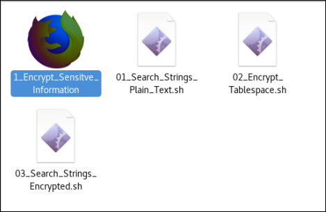

- Click the bookmark for Enterprise Manager.

  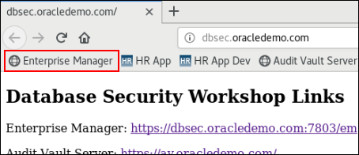

- Log in with the credentials SYSMAN/Oracle123 and navigate to the PDB Database home page by selecting the Databases menu item from the 'Targets' drop down menu as shown below.

  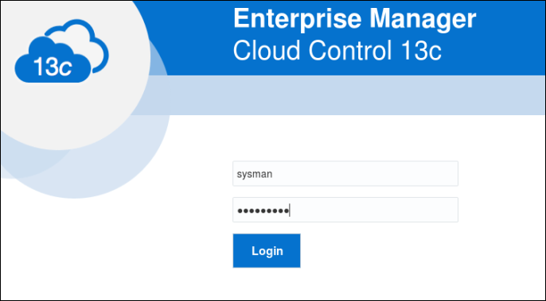

  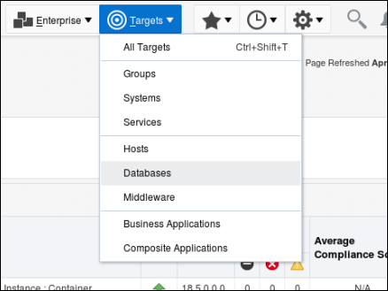

- Expand the tree structures and click the pluggable database 'cdb_PDB1' as shown.  There may be additional targets, but cdb_PDB1 will appear in the Pluggable Databases tree.

  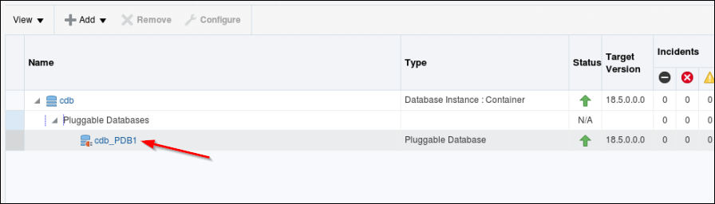

  This opens the PDB1 home page.  Review the status of your environment by selecting Security → Transparent Data Encryption. 

  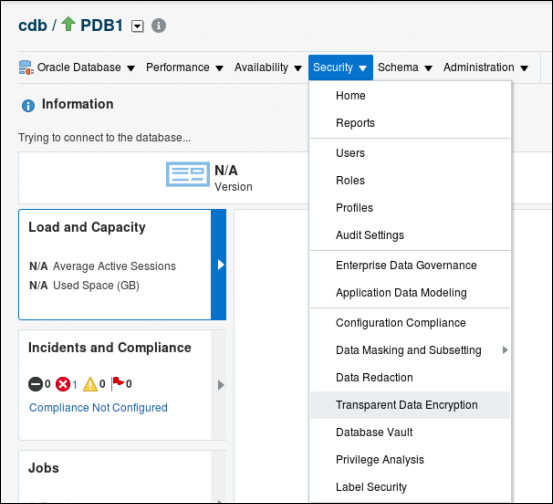

  If the Database Login page appears, then log in as an administrative user, such as SYS. User SYS must log in with the SYSDBA role selected.  For convenience, select from one of the saved Named Credentials for PDB1, then click Login.

  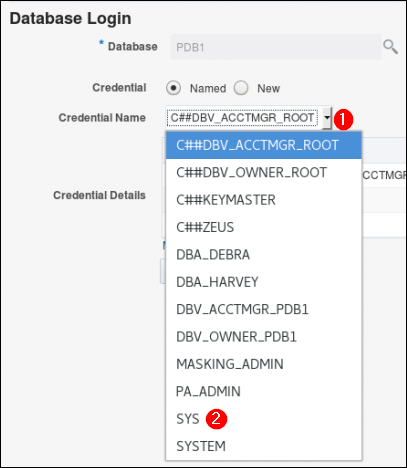

- Expand on the Keystore and Master Keys section in the lower left hand corner and review the information provided in the Oracle Advanced Security – Transparent Data Encryption screen.  Notice that the Keystore Status is OPEN and you have one Master Key in use—pdb1.   You can now encrypt data within the database. 

  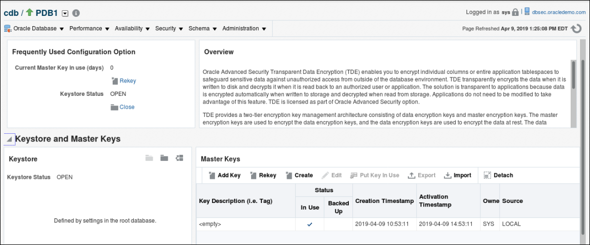

- Scroll down and expand Encrypted Objects. Observe there are currently no encrypted objects in the PDB

  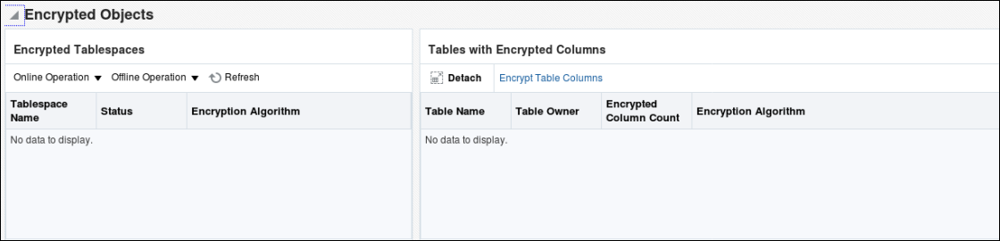

- Within Encrypted Tablespaces, Click Offline Operations and choose Offline

  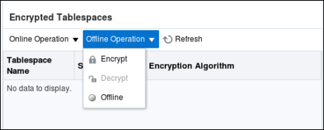

- Click the magnifying glass icon to search for a tablespace to put offline

  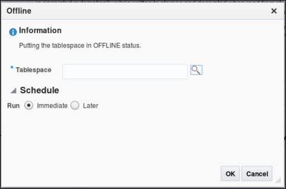

- Choose EMPLOYEESEARCH_DATA as the tablespace, and click OK

  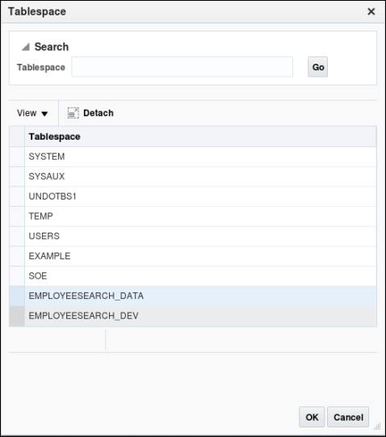

- Ensure Run Immediate is selected, then Click ok

  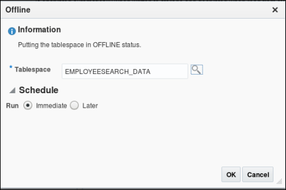

  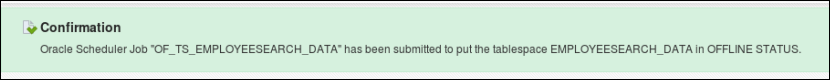

- Scroll back down to Encrypted Tablespaces, Click Offline Operation, and click Encrypt

  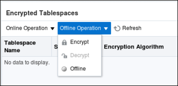

- Click the search icon 

  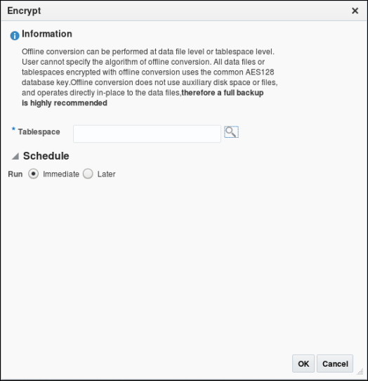 

- On the Tablespace page, choose EMPLOYEESEARCH_DATA as the tablespace to encrypt. Click OK.

  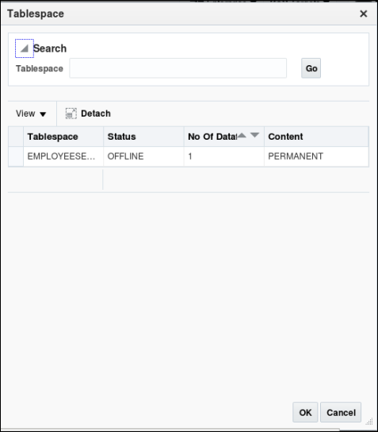

- Ensure Run Immediate is selected, then click ok

   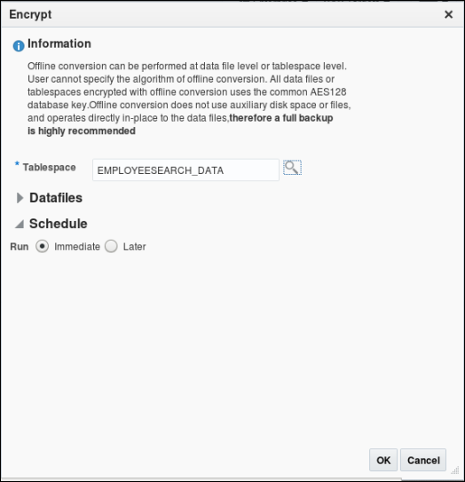 

   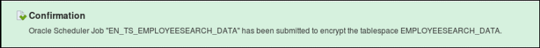

- Under Encrypted Objects, click Refresh on Encrypted Tablespaces. Within a few seconds you should see EMPLOYEESEARCH_DATA back ONLINE with AES128 encryption

  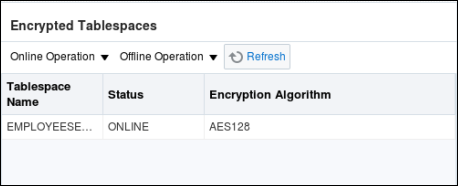

- Back in the Oracle_Advanced_Security desktop folder, click 03_Search_Strings_Encrypted.sh and verify that the data has been encrypted.  It will look similar to this screenshot

  **NOTE:** In this lab we did not use the 02_Encrypt_Tablespace.sh 

  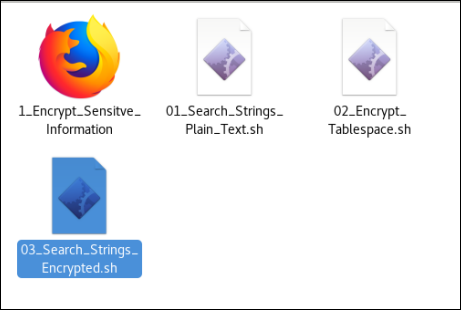

  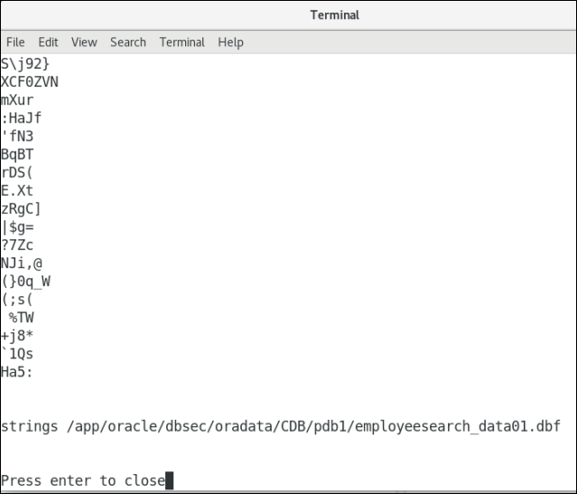

- Finally, return to the Security -> Transparent Data Encryption Section.

  Review in the Encrypted Objects section that the tablespace, EMPLOYEESEARCH_DATA is encrypted with the default Encryption Algorithm.

You have now demonstrated encryption of datafiles by the database, completely transparently to any application.  
For additional information, see also:
- "Checking Encrypted Tablespaces in the Current Database Instance" to query the database for existing encrypted tablespaces
http://docs.oracle.com/cd/E16655_01/server.121/e17609/tdpsg_encryption.htm#CHDECIDD
- Oracle Database Advanced Security Administrator's Guide for detailed information about tablespace encryption
http://docs.oracle.com/cd/E16655_01/network.121/e17729/toc.htm
- Oracle Database SQL Language Reference for more information about the CREATE TABLESPACE statement
http://docs.oracle.com/cd/E16655_01/server.121/e17209/statements_7003.htm#SQLRF01403

 #### Conclusion

 As data exposed in applications continues to rapidly expand, enterprises must have strong controls in place to protect data no matter what devices or applications are used. Oracle Database helps organizations keep their sensitive information safe in this increasingly complex environment by delivering preventive, detective and administrative controls that enforce data security in the database. Oracle Advanced Security with Oracle Database provides two critical preventive controls.

Transparent Data Encryption encrypts data at rest to stop database bypass attacks from accessing sensitive information in storage. Data Redaction reduces exposure of sensitive information in applications by redacting database query results on-the-fly, according to defined policies. Together these two controls form the foundation of a multi-layered, defense-in-depth approach, and further establish Oracle Database as the world’s most advanced database security solution.

**This completes the lab!**

- [Database Security Workshop Landing Page](https://github.com/kwazulu/dbsec-workshop/blob/master/README.md)
