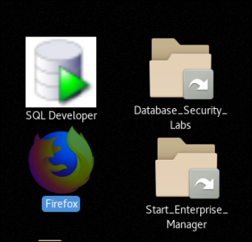
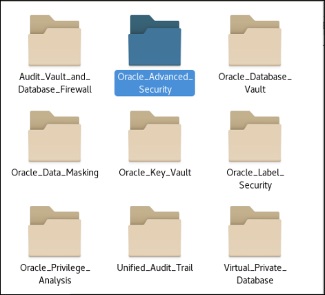
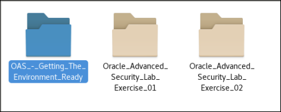
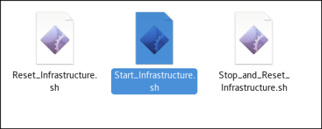
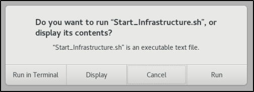

# Database Security Workshop: Advanced Security - Transparent Data Encryption

## Introduction

This is the first of several labs which are part of **Oracle Database Security Workshop.** This workshop will walk you through the process of configuring, validating and using all of Oracle's Database Securtity products

Oracle Advanced Security comprises two security features to protect sensitive data in your databases. The first feature is Transparent Data Encryption (TDE) which encrypts data "at rest". Encryption is done using a key that must be available to a database that either reads or writes encrypted data. The encryption is performed inside the data files that store the Oracle Database data. It remains encrypted until it is retrieved from disk for use in an application. This is true for any other use of the data files — exporting tables, backing up data files, and so on — the data included in the export file or on backup disks or tapes will remain encrypted until used in a database with a matching encryption key.

***To log issues***, click here to go to the [github oracle](https://github.com/oracle/learning-library/issues/new) repository issue submission form.

## Required Artifacts

- The following lab requires:
  - Laptop (Windows, Mac or Linux)
  - VNC client

## Encrypting your data

### **STEP 1**: Getting the environment ready

- On the Oracle Linux Desktop, navigate to the Database_Security_Labs folder, double-click and open the contents. 

    

- Select the folder, Oracle_Advanced_Security.

  

- Select the folder, OAS_-_Getting_The_Environment_Ready.

  

- In the OAS_-_Getting_The_Environment_Ready folder, select Start_Infrastructure.sh.  This script will start all the infrastructure necessary to complete the ASO lab exercises. In these lab exercises, use the Display button to view the contents of the scripts before executing.  This will allow you to review the steps, commands and scripts being used.  When executing scripts, use the Run in Terminal button.

  

  

- Please be patient as the infrastructure may take some time to start.  Once the infrastructure has started, you are ready to move forward with the exercises.

## Labs

[Lab 100: ENCRYPTING A TABLESPACE](100%2FREADME.md)

