# Oracle Audit Vault & Database Firewall: Managing an Audit Policy

## Lab 100: MANAGING AN AUDIT POLICY

### Overview

- Demonstrate traditional native Oracle database auditing and the audit settings configured for this environment.
  - Create a table, configure auditing on that table then confirm that the audit records are being generated successfully
  - Review the Oracle Database Secure Configuration ‘Best Practice’ audit policies 
  - Configure the PDB1 database with Secure Configuration ‘Best Practice’ Audit Policy
  - Execute an automated workload generation SQL Script to test the audit policies and confirm that the audit data is being collected by Audit Vault.

### **Setting Up**
    
- After the Start_Infrastructure.sh script finishes, open the Labs folder on the Oracle Linux Desktop, and navigate to the Oracle_Advanced_Security folder.

  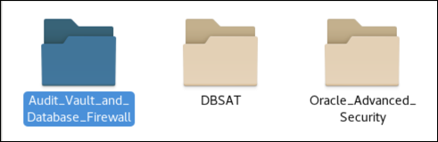

- Open the ‘AVDF_–_Section_1_Native_Database_Audit_Collection’ folder.

  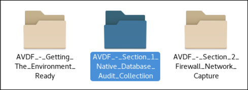

- Open the ‘Audit_–_Lab_Exercise_01’ Folder 

  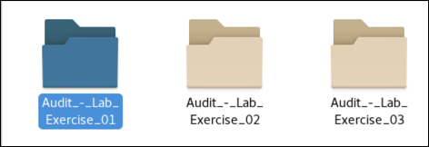

- You will now step through a simple example of native Oracle database auditing.  To start the audit test, click the icon ‘Step_1_–_Demonstrate_Native_Database_Auditing.sh’. 

  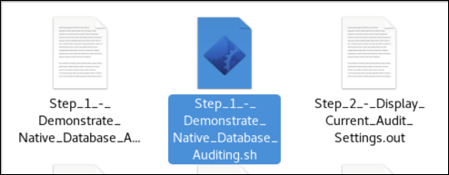

- Click the icon, Step_1_–_Demonstrate_Native_Database_Auditing.out and view the output of the script executed.

  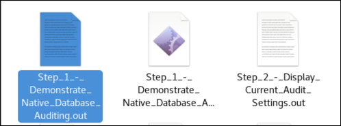

- You first queried the sys.aud$ table to show the number of audit records in the database audit table before you started your test. Your numbers will be different, but will set a baseline.

      system@PDB1> select count(*) from sys.aud$;

      COUNT(*)
      ----------
      7

- You then connected to the database, using DBA_DEBRA, and ran CREATE TABLE AS SELECT from the HR.EMPLOYEES table into the HR.EMPLOYEES_TWO table. Then you counted the audit records again.

      system@PDB1> conn dba_debra/Oracle123@pdb1;
      Connected.

      GLOBAL_NAME
      ----------------------------------------------------------------------------------------------------
      dba_debra@PDB1

      dba_debra@PDB1> create table hr.employees_two as (select * from hr.employees);

      Table created.

      dba_debra@PDB1> 
      dba_debra@PDB1> conn system/Oracle123@pdb1;
      Connected.

      GLOBAL_NAME
      -------------------------------------------------------------------------------------------------
      system@PDB1

      system@PDB1> select count(*) from sys.aud$;

      COUNT(*)
      ----------
      9

- You checked the sys.aud$ table again.  Notice that the number of records increased—incrementing 1 for the create table, and another 1 for the select.  

  You ran SELECT the COUNT() on the newly created HR.EMPLOYEE_TWO table to find its record count.

      dba_debra@PDB1> select count(*) from hr.employees_two;

      COUNT(*)
      ----------
      107

- You checked the sys.aud$ table again Note that the number of records had not increased as you might have expected. The SELECT command was not being monitored.

  You set the audit policy on the table to monitor SELECTS’s.

      dba_debra@PDB1> conn system/Oracle123@pdb1;
      Connected.

      GLOBAL_NAME
      ------------------------------------------------------------------------------------------------
      system@PDB1

      system@PDB1> select count(*) from sys.aud$;

      COUNT(*)
      ----------
      9

  You repeated the query to ‘SELECT’ from the hr.employees_two table and re-queried the sys.aud$ table.

      dba_debra@PDB1> select count(*) from hr.employees_two;

      COUNT(*)
      ----------
      107

      dba_debra@PDB1> 
      dba_debra@PDB1> conn system/Oracle123@pdb1;
      Connected.

      GLOBAL_NAME
      -------------------------------------------------------------------------------------------------
      system@PDB1

      system@PDB1> select count(*) from sys.aud$;

      COUNT(*)
      ----------
      10

  The audit record count had increased by 1, because the SELECT statement was audited. Having completed this test, you turned off auditing of the HR.EMPLOYEES_TWO table and dropped the table. 

- Click the Icon ‘Step_2_–_Display_Current_Audit_Settings.sh’.  This script will login to CDB and show audit trail and sys operations parameter, and audit destination parameter.  In Oracle Database , these settings are at the Container Database level.

   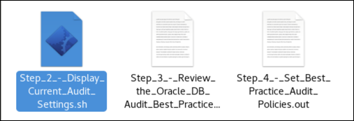

 Click the icon, Step_2_–_Display_Current_Audit_Settings.out.  In the output you can verify that the initialization parameter AUDIT_TRAIL is set to the value DB, EXTENDED and that AUDIT_SYS_OPERATIONS is set to TRUE.

 Note that the script checks the parameters for audit_file_dest, audit_sys_operations, audit_syslog_level and audit_trail.

      sys@CDB> show parameter audit;

      NAME                                 TYPE        VALUE
      ------------------------------------ ----------- ------------------------------
      audit_file_dest                      string      /app/oracle/dbsec/admin/cdb/ad
                                                      ump
      audit_sys_operations                 boolean     TRUE
      audit_syslog_level                   string
      audit_trail                          string      DB
      unified_audit_sga_queue_size         integer     1048576
      unified_audit_systemlog              string
      sys@CDB> exit;

 The ‘audit_trail’ parameter can be set to one of several values – this controls where the DB writes audit records.  There are three basic options: OS, XML and DB.  When ‘audit_trail’ is set to either ‘OS’ or ‘XML’ audit records are written to the location specified in the ‘audit_file_dest’ parameter.  This is set to /app/oracle/dbsec/admin/cdb/adump for your  database.  

 When the ‘audit_trail’ parameter is set to either ‘DB’ or ‘XML’ you can add the ‘EXTENDED’ parameter to capture SQL Text and SQL Bind variables.  This greatly enhances the information that is captured.  When the ‘audit_trail’ parameter is set to ‘DB’ audit records are written to the aud$ table.

 Finally, the parameter ‘audit_sys_operations’ will monitor all activity performed by users logged in as either sysdba or sysoper.  These records will also be written to a file in the location specified by ‘audit_file_dest’.
 
 Unified_audit_sga_queue_size is a new parameter for Oracle Database 12c and relates to the new Unified Audit Trail that is not covered in this lab.

- Double click the icon, ‘Step_3_–_Review_the_Oracle_DB_Audit_Best_Practice’

  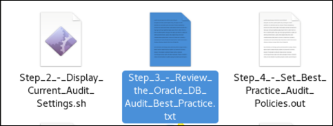

 The SQL file contains Oracle Database Audit Policies that are considered to be the best practice for monitoring system activity.  For your implementation you can use this Audit Policy as a starting place, and then tailor the policies to meet your specific business requirements.  The policy does not contain any audit policies for monitoring specific objects.

      -- DEFAULT Oracle Database AUDIT Settings

      Audit alter any table by access;
      Audit create any table by access;
      Audit drop any table by access;
      Audit Create any procedure by access;
      Audit Drop any procedure by access;
      Audit Alter any procedure by access;
      Audit Grant any privilege by access;
      Audit grant any object privilege by access;
      Audit grant any role by access;
      Audit audit system by access;
      Audit create external job by access;

- Double click the icon labeled ‘Step_4_–_Set_Best_Practice_Audit_Policies.sh‘.  As the name implies, you will set these audit policies.  You will also set sample audit policies to be used later in this lab.

  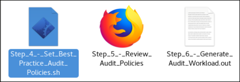

- Click the icon, Step_4_–_Set_Best_Practice_Audit_Policies.out to review the output.

      sys@CDB> 
      sys@CDB> connect sys/Oracle123@pdb1 as sysdba
      Connected.

      GLOBAL_NAME
      -------------------------------------------------------------------------------------------------
      sys@PDB1

      sys@PDB1> 
      sys@PDB1> -- Turn on auditing options
      sys@PDB1> 
      sys@PDB1> Audit alter any table by access;

      Audit succeeded.

      sys@PDB1> 
      sys@PDB1> Audit create any table by access;

      Audit succeeded.

      sys@PDB1> 
      sys@PDB1> Audit drop any table by access;

      Audit succeeded.

      sys@PDB1>

- Login to Audit Vault to review the audit policies for pdb1.  Click the icon ‘Step_5_–_Review_Audit Policies_in_Audit_Vault’.  This will bring up a browser in your image that opens up the administrative console on your Audit Vault Server.

  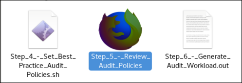

- Login as the AV Auditor using the username/password of: avauditor/Oracle123+.  Click the Login button to continue.

  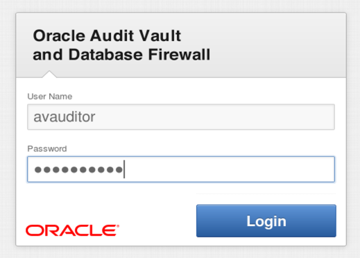

- Click the Policy Tab.

  

- Click the checkbox to select the DBSec Audit Source, ensure the interface is set to Audit Settings and click the Retrieve button.  This action will retrieve the Audit Policy from the selected database (pdb1).  

  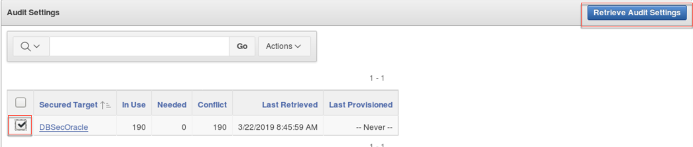

  You can view the status of the collection by clicking on the Jobs page in the left navigation

  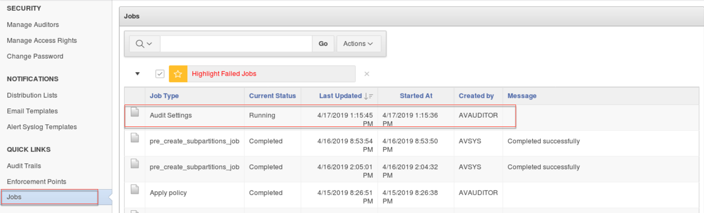

- Refresh the page by clicking on the Audit Settings tab under the Policy tab and then click the link labeled DBSec.  After a few moments you will see some audit settings appear in the summary.
 
  You can drill down on these policies.

  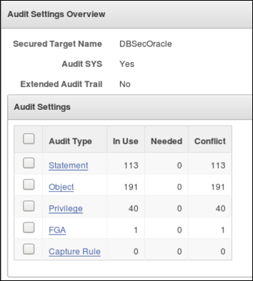

- Review the detail for the audit policy by clicking on each Audit Type link.
 
 Note that all of the retrieved policies are marked as “Not Needed” by default.  You can do a thorough review of all Audit Policies from this console, mark settings that should be kept, and re-provision.  Any “Not Needed” policies will be removed, and any new policies will be added.  After the re-provisioning, the yellow caution signs would no longer be present.  They indicate “Problems”.  A “Problem” is a mismatch between the ‘In Use’ and ‘Needed’ columns.   

- Retrieve the User Entitlement data from pdb1.  First, select the Secured Targets tab, be sure Targets is selected and then click DBSecOracle.

  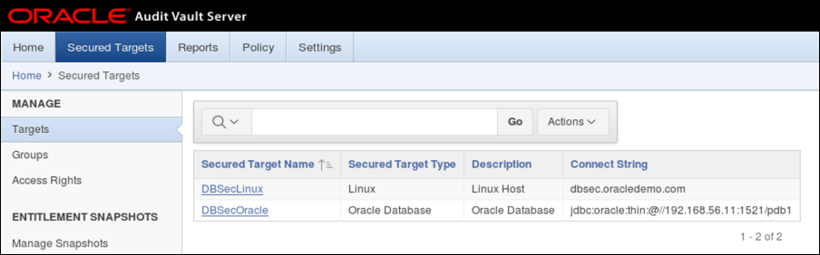

- Expand the User Entitlements section, then click Retrieve button:

  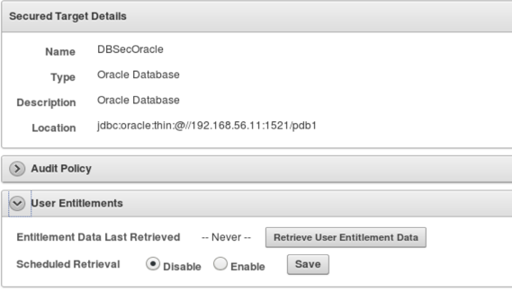

 You will see another message letting you know the user entitlement data is being collected. During the next lab exercise, you can examine the data that is collected.

- As the last step of this lab, return back to the AV_–_Lab_Exercise_01 folder and double click the icon, ‘Step_6_–_Generate_Audit_Workload’ icon.  The script generates a workload that triggers audit records to be generated.  You may see some errors when this script is run, however these can be ignored.  The errors in the script are used to demonstrate how Oracle DB auditing can capture both successful and unsuccessful transactions.  In the next lab, you will be reviewing the audit records this script generates in the Audit Vault Reporting console.

  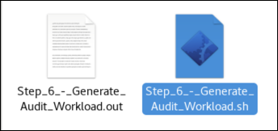

 Click the icon, Step_6_–_Generate_Audit_Workload.out to review the output of this script.  

      sys@CDB> set echo on
      sys@CDB> 
      sys@CDB> connect sys/Oracle123@pdb1 as sysdba
      Connected.

      GLOBAL_NAME
      ------------------------------------------------------------------------------------------------
      sys@PDB1

      sys@PDB1> alter user oe identified by oe account unlock;

      User altered.

      sys@PDB1> alter user sh identified by sh account unlock;

      User altered.

      sys@PDB1> alter user scott identified by tiger account unlock;

      User altered.

      sys@PDB1> alter user pm identified by pm account unlock;

      User altered.

      sys@PDB1> alter user hr identified by hr account unlock;

      User altered.

      sys@PDB1> alter user bi identified by bi account unlock;

      User altered.

 ### Conclusion

- In this lab exercise, you have: 
  - Demonstrated native Oracle database auditing and the audit settings configured for this environment.
   - Created a table, configured auditing on that table and then confirmed that the audit records are being generated successfully
 - Reviewed the Oracle Database Secure Configuration ‘Best Practice’ audit policies 
 - Configured the PDB1 database with Secure Configuration ‘Best Practice’ Audit Policy
 - Executed an automated workload generation SQL Script to test the audit policies and confirm that the audit data is being collected by Audit Vault.

**This completes the lab!**

- [Database Security Workshop Landing Page](https://github.com/kwazulu/dbsec-workshop/blob/master/README.md)
- [Continue to Next Lab(200)](../200)