# Oracle Audit Vault and Database Firewall 

## Lab 200: REDUCE TIME TO COMPLIANCE USING ORACLE AUDIT VAULT REPORTING

### Overview

- In this lab exercise, you will accomplish the following:
     - Generate a variety of reports available in Audit Vault including:
          - Data Access Report
          - Database Vault Audit Report 
          - System Management 
          - Entitlement Snapshot
          - Compliance Reports
    
- Once you determine what you need to audit, you will have a better understanding of which reports are needed to demonstrate compliance to the various requirements.  In this exercise, you will see how to generate useful reports to these Database Audit Requirements.dfs

  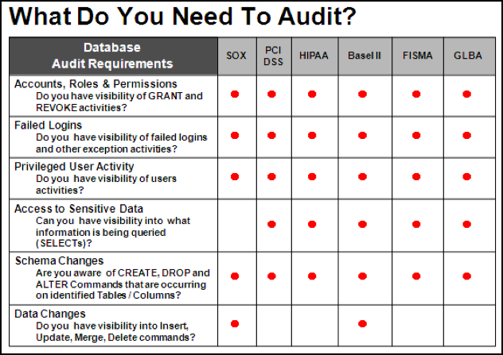

- Open **Audit – Lab Exercise_02**  folder.

- Double-click the **Step_1_–_Reduce_the_Cost_of_Compliance_Reporting** icon.  This will open up the browser.

- Login as the AV Auditor using the username/password of: **avauditor/Oracle123+**.  Click the Login button to continue.

  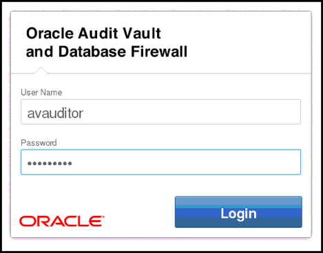

  
### Data Access Reports

- Click the **Reports** tab and select the **Data Access** report within the **Activity Reports** section (expand that section).  View the report by clicking on the **Data Access** link and verify that you see audit records that were collected on today’s date. (Uncheck **Event Time is in the Last 24 hours** to see further back)

  

  

- Review the **Data Access Report**.  The Data Access Report displays audited data manipulation language (DML) activities (i.e. SELECT, INSERT, UPDATE or DROP SQL) statements.

  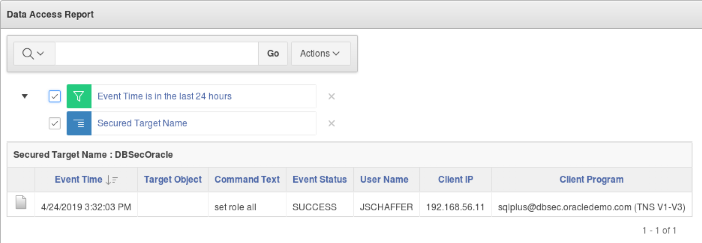

- Return to the **Reports** page by clicking on the breadcrumb above the report

  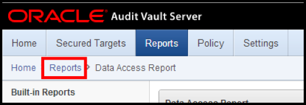

- Click the **Database Schema Changes** report.  All DML activity is captured here.  Here are some sample audit policies that will generate records here.
     - AUDIT  DELETE;
	- AUDIT  INSERT;
	- AUDIT  SELECT;
	- AUDIT  TRUNCATE TABLE;
	- AUDIT  UPDATE;
	- CREATE USER;

  

### Secured target startup and shutdown report

- Return to the **Activity Reports** page under the **Reports** tab.  Select **Startup and Shutdown** report.  It lists STARTUP and SHUTDOWN operations on a database.  Drill into one of these records: 

  

  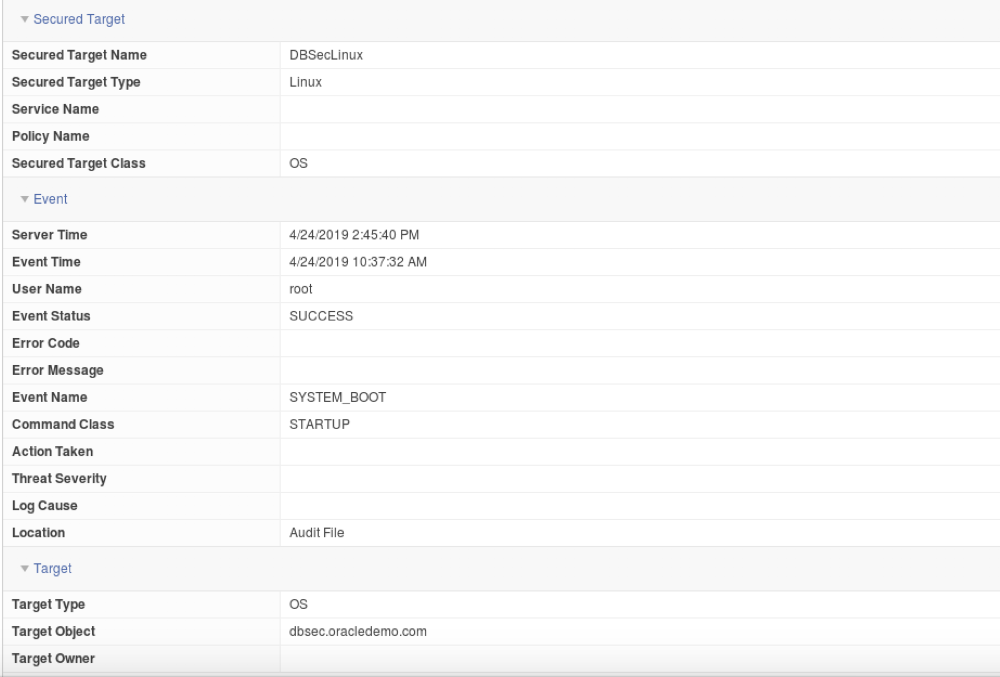
  
### Entitlement snapshots & reports

- Go back to the **Reports** tab and select **Entitlement Changes**.  This report shows all User Entitlement activity for a specific period of time:

  

- However, it will generally be more useful to report on what has CHANGED over a specific period of time.  Navigate to the **Activity Reports** page and then open the **Entitlement Reports** section:

  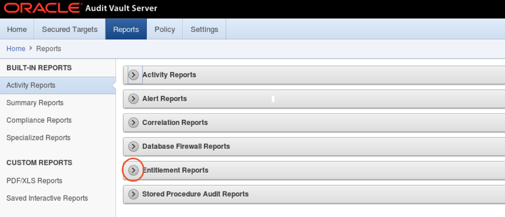

- Click the **User Accounts** report. The **User Accounts** Report displays the latest snapshot of Database users with their account profile and values for sources registered with Oracle Audit Vault.

  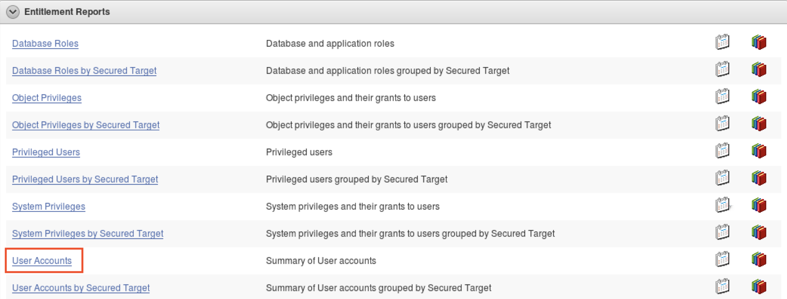

- Initially you will not see any reporting data.  Click **Go** (next to the **Label** drop down).  This will bring back the latest Entitlement snapshot that you just retrieved from the source database.  You can take multiple snapshots of user entitlement data, this report lets you look at the data for any of these snapshots.  You can also compare different snapshots to see how the data has changed over time.

  
  
### Compliance Reports

- Click the **Compliance Reports** tab.  The reports shown here are intended to help you meet your compliance reporting requirements as quickly as possible, across PCI, Sarbanes-Oxley, HIPAA (healthcare-related) and other areas. We will look at the **Payment Card Industry (PCI) Reports**. To select the databases you are interested in generating reports for press **Go**

  
  
- Make sure you select **DBSecLinux** and **DBSecOracle** targets and press **Add Members**. Also don't forget to save!

  

- Click the **Login Failures** link under the **Payment Card Industry (PCI)Reports** section. This report lists all of the DB login failures across the audited sources.  

  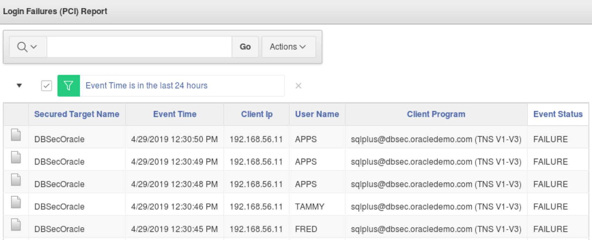

- You are able to alter the scope of the report to a specific set of objects for the databases or objects they are covered by your regulatory requirement.  To do this, click **Actions**

  

- You are able to change the definition of the report. Click **Filter**.  Pick the Column **User Name**, the Operator **=** and then pick a specific user, like **FRED** or **APPS** 

   

- In addition, by clicking on the **Actions Menu**, you can further customize your reports. You can: 
     - Select more columns to display
	- Filter the report
	- Sort rows
	- Highlight rows
	- Generate a chart
	- Save the report for future use
	- Download the report to CSV or HTML
     
   
  
- After changing the definition, choose **Save Report**.  Assign a name, create your own description. 

  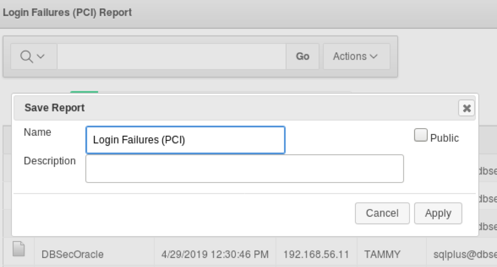
   
### Scheculed Reports
- Browse to **Compliance Reports** tab and select the report **Database Schema Changes** under the PCI section. We are going to time schedule the report and create a PDF version that could then be sent to people who require it. Click the **Calendar** icon.

  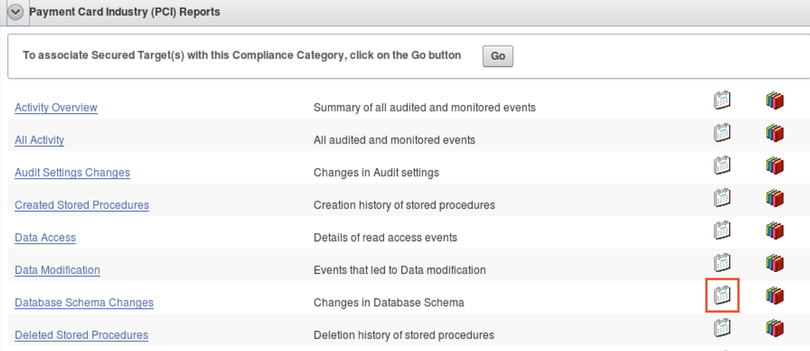

-  The **Create/Edit Scheduled Job** screen opens.  Select PDF or XLS as an output format.

   

- You can schedule the report to be run immediately or on a schedule.  For this lab, set the schedule to weekly. To do this, select the radio button **Specify Schedule** option in the **Schedule** section. Then, in the **Repeat** section, select **Weekly**. Mark **Start Date** and select today’s date, leaving the remaining fields default, as shown below.

  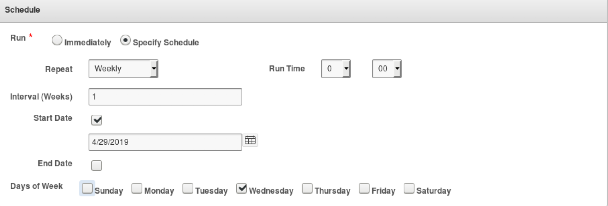
  
- In the **Attestation** section select the **AVAUDITOR** and **PCISLEY** users and move the user to the right hand pane using the **>** button. 

  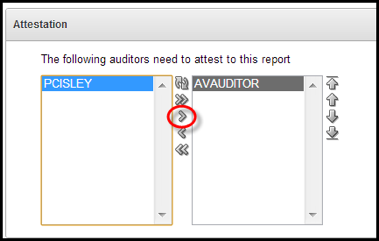

- Finally, click the Schedule button at the top right hand side of the page.  

  

- You will be re-directed to the **Report Schedules** where you will see that your report is now scheduled to run every week.

  
  
### Understanding Attestation 

- You will now create a PDF report immediately to see the attestation process at work.  Go back to the PCI section under **Compliance Reports** tab and select the report **Entitlements Changes**. Click the **calendar** icon.

  
  
- You should see the **Create/Edit Scheduled Job** screen, which you used in previous steps. 
In the **Attestation** section, move the **AVAUDITOR** user to the right hand pane.   

  

- Leave all other fields as default and click the **Schedule** button. 

  
  
- On the **Generated Reports** page, click the **Show Pending Reports** button to see your report in Progress.  Wait a few seconds, and return to the **Generated Reports** page.

  
  

- Click the **Details** button associated with the report. 

  

- Click the **View Report** button to review the PDF.  The PDF will download in your browser.

  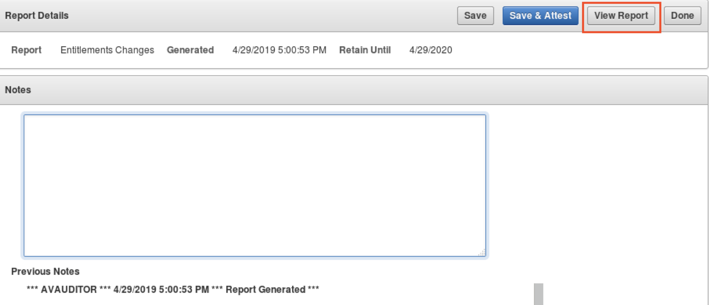

- View PDF file

  

- Return to the Report Details page add an attestation note such as, **I have reviewed and attest to the data in this Report** and click the **Save & Attest** button.

  
- After clicking on the **Save & Attest** button you will see that the attestation note is stored with the report, as shown below.

  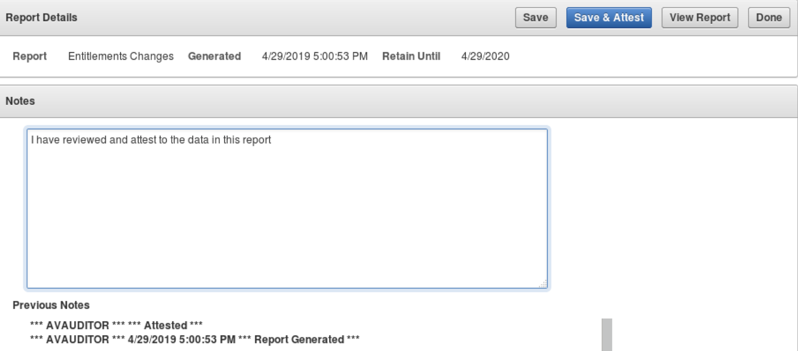
  
- Click **Done** once you have finished.

## Additional Steps

- Quickly review other reports and the audit data they collect. Take a look at some of the reports.  It is important to point out that these reports will eventually (after the next set of lab exercises) include data collected from all sources, including Database Auditing and Firewall.

 ### Conclusion

- Generated a variety of reports available in the Audit Vault Server.
     - Data Access Reports
     - System Startup and Shutdown
     - Entitlement Reports
     - Compliance Reports

**This completes the lab!**

---

[Next Lab](../300/README.md)

[AVDF Landing Page](../README.md)

[Database Security Workshop Landing Page](https://github.com/kwazulu/dbsec-workshop/blob/master/README.md)

