# Oracle Audit Vault & Database Firewall: Database Firewall

## Lab 400: CONFIGURE ORACLE DATABASE FIREWALL TO MONITOR AND PROTECT DATABASES

#### Overview

The Oracle Database Firewall system secures and protects data in SQL databases. It blocks attempted attacks, logs activity, and produces related warnings and provides tools to assess vulnerabilities. The Database Firewall system augments existing database security features, such as encryption and user authentication, and brings significant advantages over traditional database firewall systems.  Traditional systems usually test the syntax of statements passed to the database, recognizing predefined expressions. Creating a set of rules using this technique requires a hand-crafted approach and can be very time-consuming and complex, even for someone very knowledgeable about the database. Even if significant resources create satisfactory protection for known threats, little protection may be offered for unknown threats. The Database Firewall addresses these challenges.

The Oracle Database Firewall system works by analyzing the meaning of the SQL statements that database clients send to the database. This provides a much higher degree of protection than traditional database firewalls, because it does not depend on the source of an attack or on recognizing the syntax of known security threats. The database firewall can block previously unseen attacks (known as "zero-day" attacks), including those targeted individually against your organization. Zero-day attacks are becoming more widespread, and there is great need to protect databases against such attacks.

- In this lab exercise, you will accomplish the following:
  - Generate simulated database activity on expected authorized traffic
  - Monitor Oracle Database traffic in the Database Firewall Management console
  - Prepare to train the Database Firewall with acceptable and expected behavior

    
- After the Start_Infrastructure.sh script finishes (Database_Security_Labs > AVDF_-_Getting_The_Environment_Ready > Start_Infrastructure.sh), open the Labs folder on the Oracle Linux Desktop, and navigate to the Audit_Vault_and_Database_Firewall folder.

  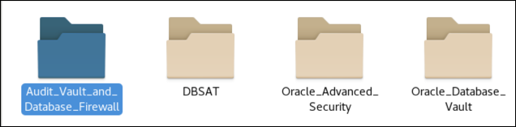

- Select the folder, AVDF_-_Section_2_Firewall_Network_Capture

  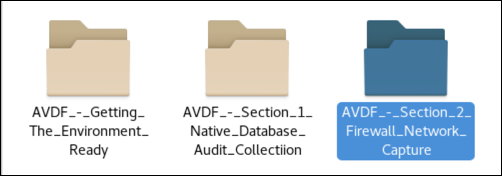

- Open the FW-_Lab_Exercise_01 folder

  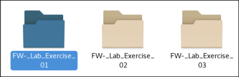

- In your lab folder, click the ‘Step 01 – Set up Firewall Proxy’ icon.

  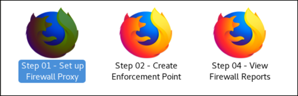

- Log in to your Firewall as fwadmin/Oracle123+ 

  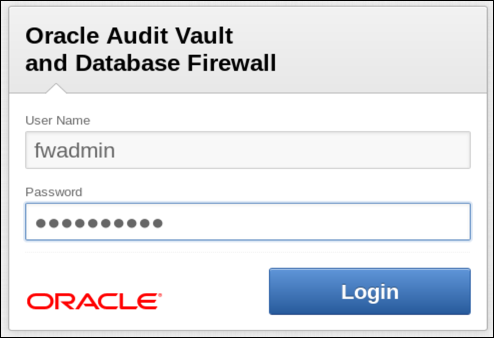

- This firewall will be used as a Traffic Proxy.  

  There are several flexible ways to deploy the Database Firewall depending on your requirements and network topology.  You have the option to deploy inline as a bridge, out of band (e.g., using a span port from your network switch), or configured as a proxy.   In this lab, you will configure and deploy the Database Firewall as a proxy.

  Depending on your network configuration, when using Oracle Database Firewall in DPE mode, you may prefer to configure a traffic proxy in Oracle Database Firewall instead of a bridge in line with network traffic. You can then associate the proxy with an Enforcement Point. 

  You can also specify multiple ports for a proxy in order to use them for different Enforcement Points.  The proxy port has already been configured for the lab environment. All of the database traffic will be directed to the Firewall on Port 15212.  

- To view this, click the **System** tab, then on the **Network** link as shown below.

- Take a look at the Management Interface.  These settings were captured during the installation.  This is the screen you would use if changes were necessary.  

  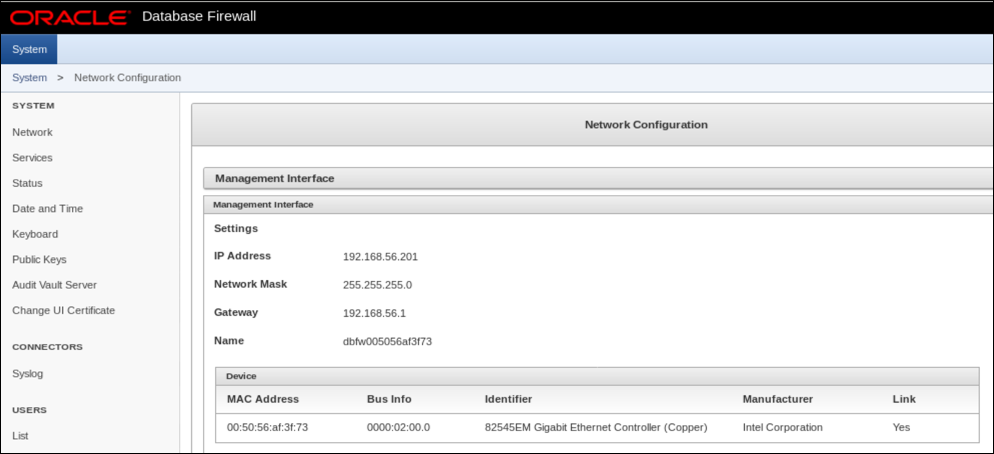

- This is an example of configuring a Firewall with a single network interface.  Other configurations are possible.  For example, one network interface may act as a proxy, while another might monitor traffic from a SPAN port while yet another sits inline and monitors traffic directed right at the database listener on port 1521.

  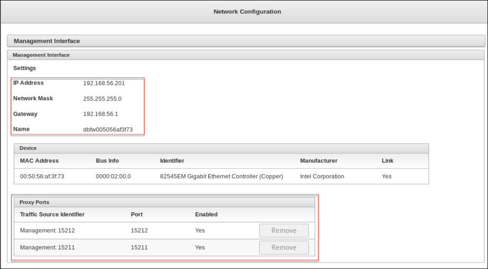

- Next, you need to be aware of an important configuration option of the Oracle Database Firewall.  Navigate to the **System > Public Keys** section by clicking on the Public Keys menu option in the left navigation.

  This Public Key is to be used if you have enabled Oracle Advanced Security to encrypt network traffic to prevent interception and exposure.  In order to decrypt database traffic using database interrogation, you must provide the Database Firewall public key to the Oracle Database that is using Oracle Native Network Encryption.

  To use this key, an entry in the sqlnet.ora file would make a reference to a file on the server containing a copy of the key data.  

  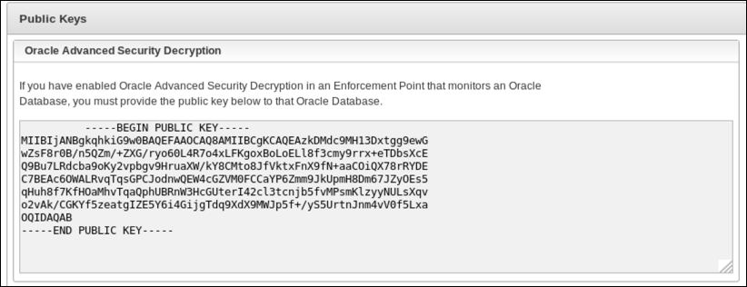

- Navigate back to the Audit Vault (Open a new tab to dbsec.oracledemo.com and select Audit Vault Server)

  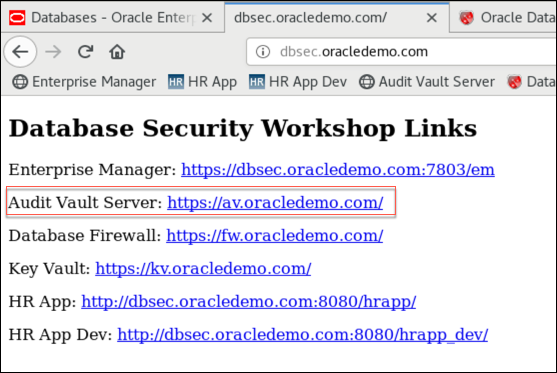

- Once the Oracle Audit Vault Server login page loads, login as the AV Administrator using the username/password: **avadmin/Oracle123+**.  Click the Login button to continue.

  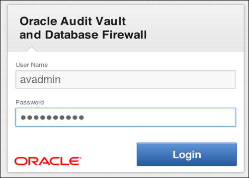

- If you look in the lower right hand section of the Home page you'll find information about Firewalls that are registered with this AVFW server:

  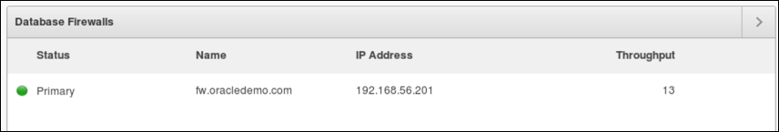

- The DBSecOracle Secured Target has already been registered.  We will now check the Enforcement Point. An Enforcement Point is the Oracle Database Firewall object that is responsible for monitoring and logging SQL statements passed to the database. Multiple enforcement points can be used to monitor traffic to different databases or at different locations in the network.

  You will be monitoring the Oracle database, pdb1.  The DBFW server will monitor and block activity to the database based on policies that you will select in the next lab.   

- Navigate to the **Secured Targets** page and click the **Enforcement Points** menu item.

  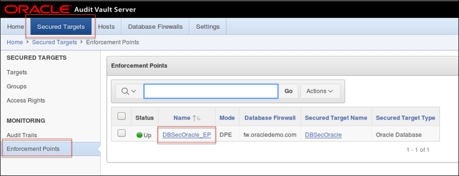

- Select the **DBSecOracle_EP** enforcement point

  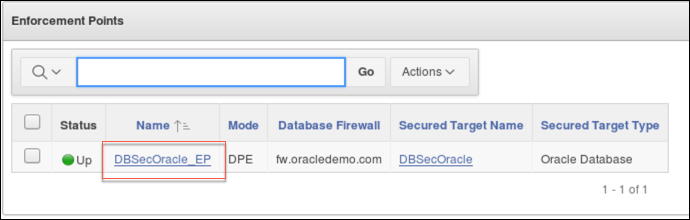

- Take a few minutes to review the settings of this enforcement point. Notice that proxy port **15212** is selected for use

  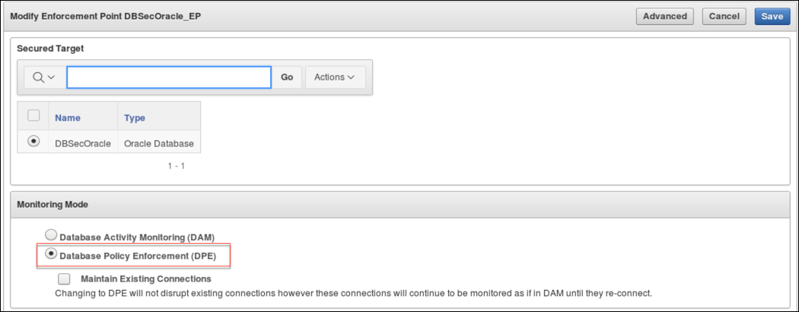

  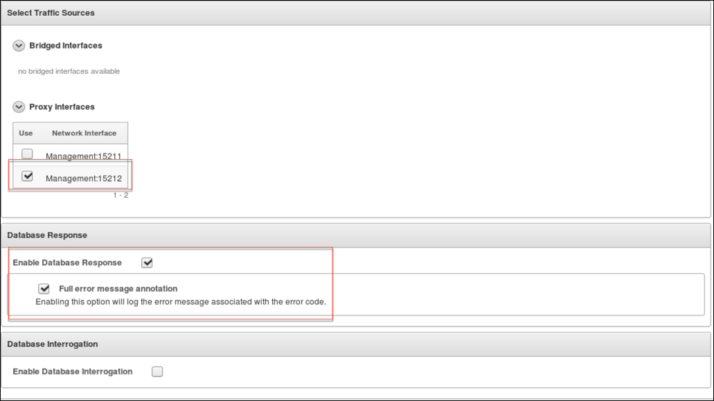

- Before testing the enforcement point, lets change the policy to Log All. Logout as avadmin and login as **avauditor/Oracle123+**

  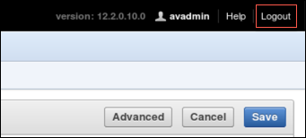 logout

  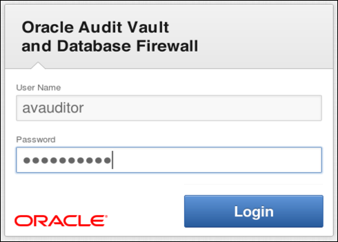 login

- Select the Secured Targets tab

  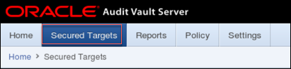

- Select the DBSecOracle Secured Target

  

- Expand the Firewall Policy section, click **Change**, select **Log All** policy, click Save

  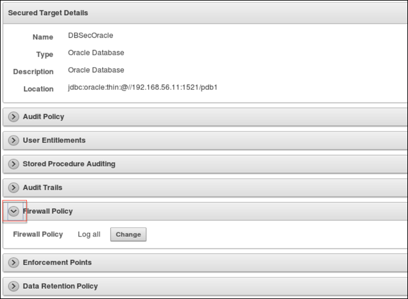
  
  
  
- Navigate to the **FW-_Lab_Exercise_01** folder and run **Step_03_-_Test_traffic_through_firewall.sh**

  View the **Step_03_-_Test_traffic_through_firewall.out** output file

      idle> conn system/Oracle123@pdb1.proxy;
      Connected.

      GLOBAL_NAME
      ----------------------------------------------------------------------------------------------------
      system@PDB1

      system@PDB1> 
      system@PDB1> select name,dbid,cdb,con_id,con_dbid from v$database;

      NAME            DBID CDB     CON_ID   CON_DBID
      --------- ---------- --- ---------- ----------
      CDB       2116305556 YES          0  110739284

      system@PDB1> 
      system@PDB1> SELECT NAME,OPEN_MODE FROM GV$PDBS;

      NAME
      ----------------------------------------------------------------------------------------------------
      OPEN_MODE
      ----------
      PDB1
      READ WRITE

- You have now connected to the database via the Database Firewall proxy port
  
  Database traffic is being directed to port 15212 on fw.oracle.com and then being returned to pdb1 via the Enforcement Point.  This short test confirms that You are able to complete SQL statements.  You will see that the SQL returns ‘PDB1’.

- Back in the browser, navigate to the **Reports** tab and view the available **Database Firewall** reports.

  Open the report **Database Traffic Analysis by Client IP** detail by clicking on the highlighted icon below. 

  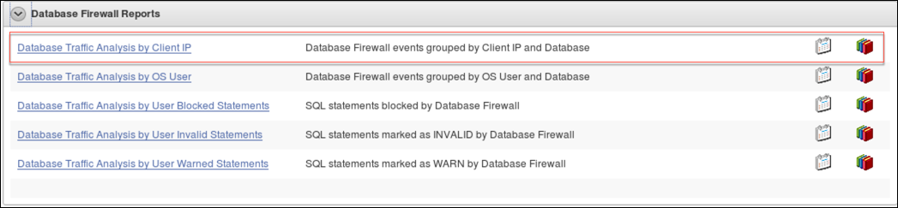

  Note that the Firewall updates the Audit Vault Server every five minutes.  You may need to wait a little while to see Report data.

  Find your select statement and drill down to view the details of the query.

   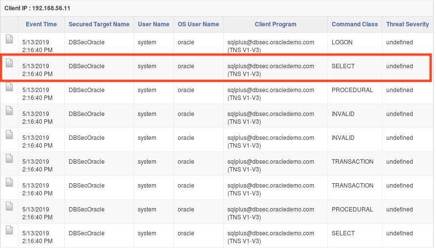

   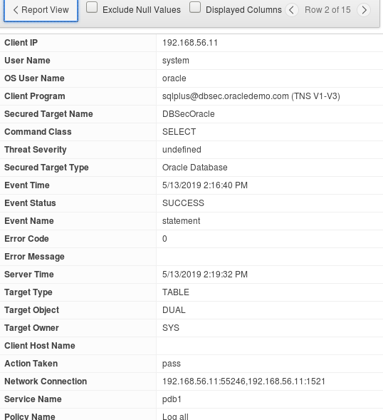

- You will now simulate some application traffic for the DBFW to train what is considered to be normal and authorized traffic for your White List policy.  Again, White List policies are simply the set of approved SQL commands that the firewall expects to see.  For this simulation you will be using a tool called **Swingbench**.  It runs SQL statements that simulate an order entry application.  It performs different DML statement using SQL bind variables to query and change customer and order information.  Click the **Step 05 – Start Swingbench** icon in your lab folder, as shown below.

   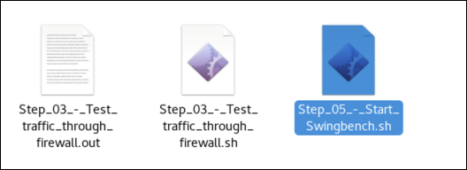

  Swingbench is a java application that will open after a few moments.  Notice that the **Connection String** is pre-configured to connect to your Oracle Database via the proxy port on the Firewall.  Click the **Start** green arrow icon, as shown below.  This will start the simulated application load.  You will run roughly 10 minutes of application traffic.

   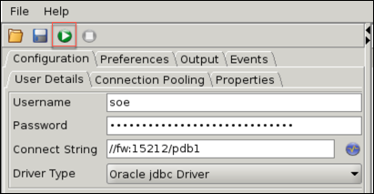

  Navigate to the **Events** tab in Swingbench.  

   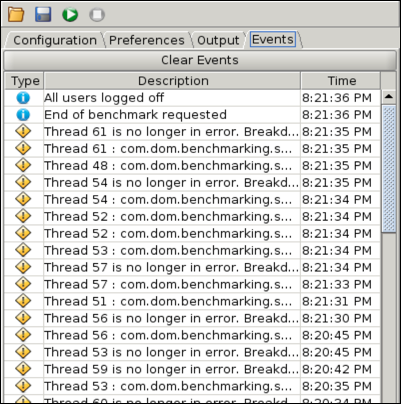

  After a few moments you will see the transactions per minute (TPM) graph show an increase in transactions.

   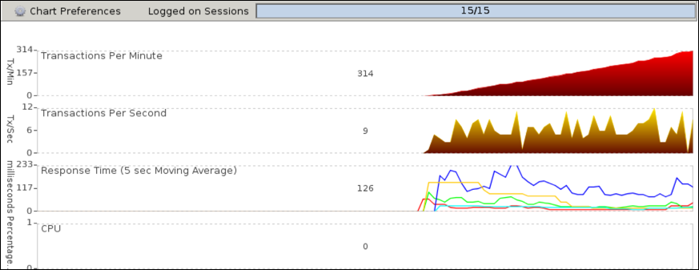

- Navigate to the browser tab you were using for Database Firewall, or go to **FW-_Lab_Exercise_01** and login using **fwadmin/Oracle123+**

- Navigate to **System > Network Traffic > Live Capture**.  Select **Packet Content* for the Level of Detail.  Click the **Show Traffic** button.

    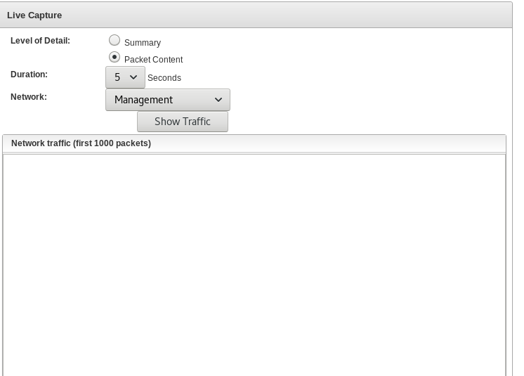

  Notice that since the network traffic is unencrypted, you can actually see some SQL statements.  As you learned earlier, Database Firewall can be configured to read network traffic encrypted by Oracle Network Encryption.

    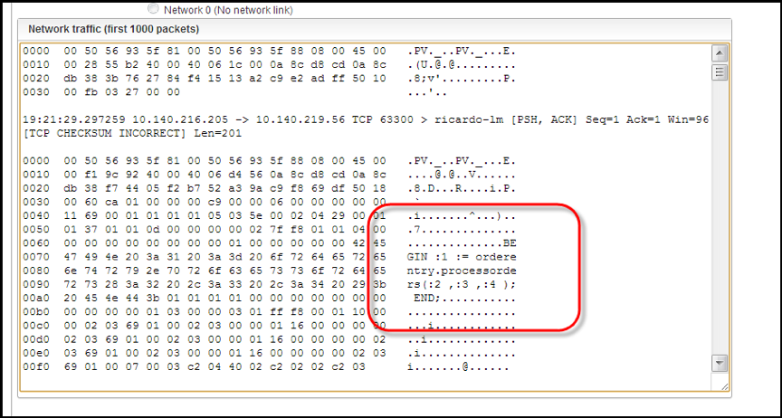

  If you turn to the Firewall reports (in the Audit Vault Server as avauditor) that you were viewing earlier, you will also see many new statements captured.  

 #### Conclusion

- In this lab exercise you reviewed the proxy port configuration of the Database Firewall. You also checked the Enforcement Point configuration, tested a database connection via the proxy port, changed the Firewall policy being enforced for the Secured Target and finally you ran some sample application traffic which will be used in the whitelist for the following labs.

**This completes the lab!**

---

[Next Lab](../500/README.md)

[AVDF Landing Page](../README.md)

[Database Security Workshop Landing Page](https://github.com/kwazulu/dbsec-workshop/blob/master/README.md)
