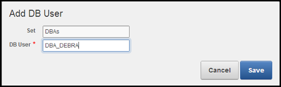

# Audit Vault and Database Firewall

## Lab 500: USE ORACLE DATABASE FIREWALL TO CONFIGURE POLICIES AND BLOCK UNAUTHORIZED TRAFFIC

### White list, Black list, Exception list policies

Oracle Database Firewall examines the grammar of the SQL statements being sent to the database, analyzes their meaning, and determines the appropriate security policy to apply. This highly accurate approach provides a significantly higher degree of protection than first-generation database monitoring technologies that relied on recognizing the "signature" of known security threats. By enforcing normal application behavior, Oracle Database Firewall helps organizations avoid the costly and disruptive false positives and false negatives common with other approaches. Oracle Database Firewall recognizes SQL injection attacks on compromised applications and blocks them before they reach the database.

### Iterative Policy Development Cycle 

Successful deployment of a Database Firewall depends on an effective policy. The Database Firewall policy editor enables you to design policies quickly and efficiently. Policy rules can depend on any combination of the SQL statement type, name of the database user, IP address of the database client, operating system user name, client program name, or any exceptions you specify.

Developing a policy is an iterative process that keeps refining and improving the policy with new data.

Developing a policy consists of these main steps:
1. Create a firewall policy in the Audit Vault Server. 
2. Design your policy by setting policy actions and rules. 
3. Publish the policy to make it available for applying to secured targets.
4. Assign the policy to selected secured targets.  


### Overview

- In this lab exercise, you will accomplish the following:
     - Complete an iterative development cycle of the baseline
     - Develop and deploy a Firewall policy
     - Modify and re-deploy the Firewall policy
     - Verify that policy is enforced and ensure that unseen traffic is blocked
### Prerequisites 

- Completion of **LAB EXERCISE 01 – ORACLE DATABASE FIREWALL SECURED TARGETS TO MONITOR AND PROTECT DATABASES**

### Create and Test a Firewall Policy
 
The Oracle Database Firewall system must understand the normal way that client applications use the database. This is accomplished by logging traffic (such as via a test suite or by recording normal application traffic before you start developing a new Policy.  You have just been through that exercise with Swingbench.  Now you will move on to creating a Policy that will substitute an innocuous SQL statement in the place of any statement that the Firewall has not seen before.

- Begin by opening the folder labeled **FW – Lab Exercise 2**.  
    
  

- Click the icon **Step 1 – Create the Firewall Policy**.

  

- Log into the Audit Vault Server as **avauditor/Oracle123+**.

  

- Navigate to the **Policy** page and select **Database Firewall Policy**.  Then click the **Create Policy** button:

  

- In the screen that appears, fill in the appropriate information

```
	Database Type:      Oracle Database
	Policy Name:        1 – Block Unseen Statements
	Description:        This will block any statements not previously seen by the Firewall.
```
- Click the **Create** button.

  

- For this first simple Policy, you are going to create two Policy Rules: one for the SQL you have already analyzed (your first SQL Statement and all the Swingbench activity) and one Default Rule for the statements not covered (all statements not previously seen by the Firewall). First, click the **Modify SQL** button:

  
  
- Next, select your Secured Target.  Click **Change**:

  
  
- Then, select your Secured Target **DBSecOracle** and then **Apply**:

  
  
- As you can see, all the statements that have been logged have been grouped into **Clusters** or groups of statements that have the same semantic meaning or intent.  Click the checkbox at the top to select **ALL** of the Clusters:

  
  
- Click the **Set Policy** button at the upper right-hand corner of the page:

  
  
- You will set all of this simulated application traffic to be allowed to access the protected database.  Select the following:
```
	Actions: 		Pass
	Logging Level:		Unique
	Threat Severity:	Insignificant
```
  
  
  
- After clicking **Save**, you’ll notice that there is no button or other navigational element to return you to the Policy Overview.  Click **Firewall Policy** to return to the list of Policies:

  
  
- Then click your Policy to continue editing:

  
  
- Implement the blocking policy for every statement that hasn’t yet passed through the Firewall.  In the **Default Rule** section toward the bottom of the page, click the **Default Rule** link.

  
 
- Now block all unwanted traffic via a substitution.  Select the following:
```
	Actions: 		Block
	Logging Level:		Always
	Threat Severity:	Major
	Substitution:		select 100 from dual
```
(This statement is harmless and does not return any values or affect performance.)
 NOTE:  Do not use a semi-colon here!
 
- Click **Apply Changes**.
 
  
  
- You are now ready to make your policy available for use by the Enforcement Point.  At the top right-hand corner of the page, click **Publish**:

  

- You will see a message that your Policy has been published successfully.  Click **Firewall Policies** to return to the list of Policies.

- You can now test the new Policy. First, see what happens before you apply it.  Click the icon labeled **Step_02_–_Run_Statements_Before_Applying_Policy.sh**.  

  
  
- Then open the output file **Step_02_–_Run_Statements_Before_Applying_Policy.out**:

  

- Notice that all of your statements executed normally and successfully:

  
  
- Now assign your Policy to your Secured Target.  In the Audit Vault Server console, click the **Secured Targets** tab.  In the Targets page, click the name of the secured target you want – **DBSecOracle**

  
  
- Expand the **Firewall Policy** section and click **Change**.

  
  
- Select your new Policy and click **Save**.

  

- Be sure to click **Save**!  You are now ready to test your new Policy.

  
  
- Now go back to your Database image.  Click the icon labeled **Step_04_–_Run_Statements_After_Applying_Policy_1_–_Block_Unseen.sh**.  

  
  
- Then open the output file **Step_04_–_Run_Statements_After_Applying_Policy_1_–_Block_Unseen.out**

  
  
- Notice that most of the statements were blocked by your substitution and that your all but last statement, **SELECT NAME, OPEN_MODE FROM GV$PDBS**, is blocked, as that was one of the statements profiled in your whitelist policy.  

  
  
- You will now refine the baseline policy to make an exception allowing SQL traffic from some administrator users.  Remember that you cannot edit a deployed Policy, so you must first copy the existing policy. 
- Click **Step 05 – Modify the Firewall Policy** icon and log into the Audit Vault Server as **avauditor/Oracle123+**.  Alternatively, just return to your earlier session.  Open the Policy page and then Firewall Policy:
- Open the policy that you just tested:

  
  
- Click the **Copy** button in the upper right-hand corner:
 
- This will bring up the Copy Policy dialog box.
  
  

- Enter the following information:
```
	Policy Name:  2 – Block with DBA Exception
	Description:  This will block any statements not previously seen by the Firewall, but allow certain users to execute these statements normally.
```
- When you are done, click the **Copy** button. You will see a message that the Policy has been copied successfully and you will be presented with a new **Policy Overview** screen:

  
  
- You will now add the exception for certain of your DBAs.  In order to add such an exception, you must first construct a **Database User Set**.  Click the **Database User Set** button at the bottom of the page.

  
  
- This will bring up the following screen.

  

- Click the **Create New Set** button.

- Enter the following information:
```
	New Set Name:  DBAs
	First Member:  sys
```
- Then, click the **Create Set** button.
 
  

  
- Now you are going to add a couple of additional users.  Click the **Add DB User** button.  Do this twice, adding system and **DBA_DEBRA**.
  
  
  
- When you are done, your screen should look like this:

  
  
- This is another case where you get back to where you were by navigating to the **Policy** page and then back in to the **Policy Overview**.

  
  
- You can now proceed with adding your **Exception**.  From the **Policy Overview**, click the **Add Exception** button.

  
  
- Enter the following information:
```
	Exception Rule:  Allow DBAs
	DBA User Set:  Include / DBAs
	Policy Controls:
		Action:           Pass
		Logging Level:    Unique
		Threat Severity:  Insignificant
```
- Then, click the **Create** button.

 
 
- You are now ready to Publish your Policy.

 
 
- Conclude this lab by testing your new Policy. **(Secured Targets > DBSECOracle > Firewall Policy)** First change the Policy associated with the Secured Target.

 

- Don’t forget to click the **Save** button.

 
 
 

- And observe. Run the script and open the output file.  All statements have been executed successfully!

 
 
#### Summary

You accomplished the following in this lab exercise:

1. Completed an iterative development cycle of a whitelist policy.
2. Developed and deployed a Policy.
3. Modified and re-deployed the Policy.
4. Verified that policy is enforced and ensure that unseen traffic is blocked.


**This completes the lab!**

--- 

[Next Lab](../600/README.md)

[AVDF Landing Page](../README.md)

[Database Security Workshop Landing Page](https://github.com/kwazulu/dbsec-workshop/blob/master/README.md)
