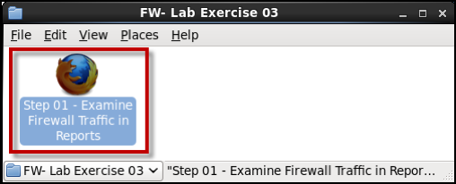
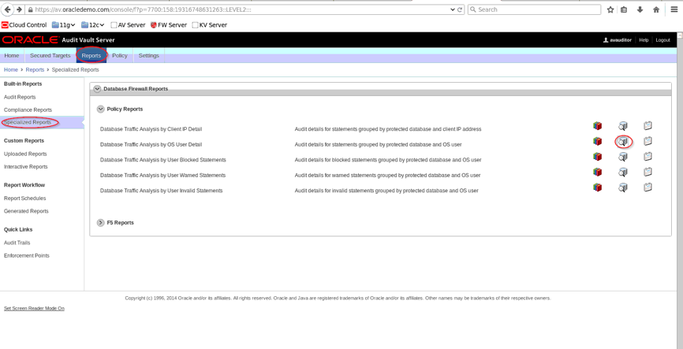
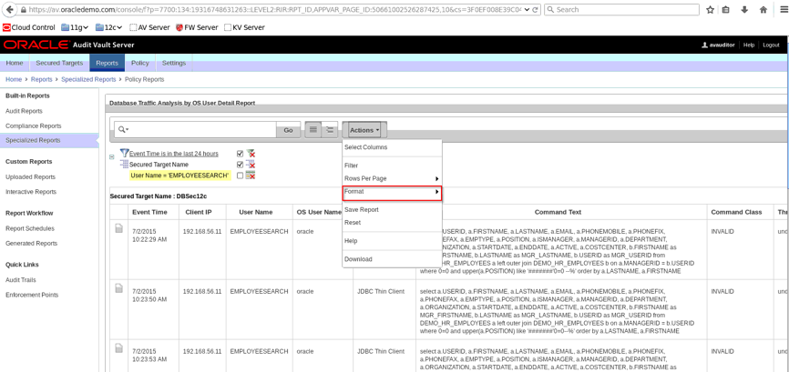
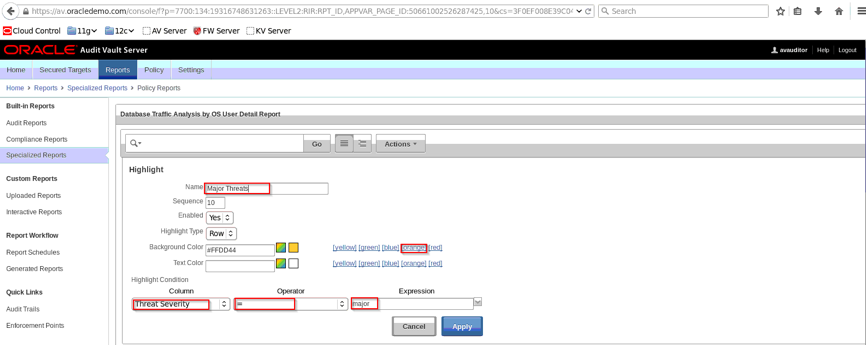
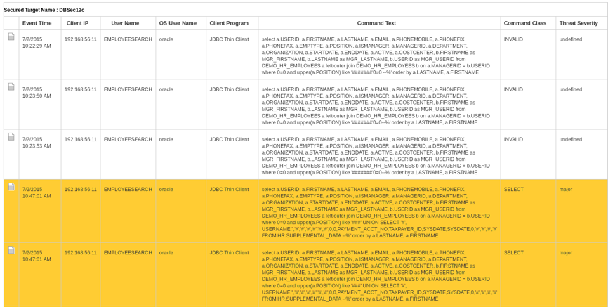

# Audit Vault and Database Firewall

## Lab 600: ORACLE DATABASE FIREWALL – GAIN VISIBILITY AND SATISFY REQUIREMENTS THROUGH REPORTING

You have already been through Reporting in some detail.  Take a few minutes and see what capturing activity via the Firewall has added to the mix

### Overview

- In this lab exercise you will accomplish the following:
     - Review Reports that contain only data captured by the Firewall
     - Review Reports that contain both native Audit data and network traffic

### Setup and Preparation 

- Completion of AVDF **LAB EXERCISE 400 – CONFIGURE ORACLE DATABASE FIREWALL TO MONITOR AND PROTECT DATABASES**

- Completion of AVDF **LAB EXERCISE 500 – USE ORACLE DATABASE FIREWALL TO CONFIGURE POLICIES AND BLOCK UNAUTHORIZED TRAFFIC**

### GAIN VISIBILITY AND SATISFY REQUIREMENTS THROUGH REPORTING

- Open up your browser and log in as **avauditor/Oracle123+**:

  

- There are several reports that contain just Firewall data.  Navigate to **Reports / Specialized Reports**:
---
Database Firewall reports contain data that is collected if a secured target is monitored by the Database Firewall according to a firewall policy, as well as data gathered if Oracle AVDF is integrated with BIG-IP ASM Web application firewall (WAF) from F5 Networks, Inc.

- Data collected by the Database Firewall includes:
     - Database Firewall action and threat level
	- Database user name
	- OS user name
	- Statement type (data definition, procedural, data manipulation, etc.)
	- Client application name and IP address
	- SQL request ID
	- Database Firewall cluster ID
	- Comparison data between F5's WAF policy and the Database Firewall policy

Look through these reports.  Reports that are grouped by IP address and Target will not look that different to you, one from another, as you have been collecting data from a single source and generating traffic from a single IP address.  In the real world, these differences would become quickly apparent.  If you made typos during any of the Exercises you may see some entries in the Invalid SQL Report.

---

- Go back to the **Activity and Compliance Reports**.  You will now see data generated both by native database auditing and by collecting data about SQL traffic passing over the network.  In many cases, the same event has been captured by Auditing and by Firewall Monitoring.  Identify some of these records, and compare the differences.

- Go back to **Specialized Reports** and select **Database Traffic Analysis** by **OS User Detail**

  
  
- You can customize your report by highlighting by using certain criteria.  Once you’ve selected which report you like to customize, click the **Actions** drop down and go to **Format**.  
  
  
  
- Under **Format**, there are options such as sort, highlight and graph.  For instance, if you want to highlight a major threat, the criteria are:

  
  
- Once you click **Apply**, this is how your report would look

  
  
### Conclusion

- You accomplished the following in this lab exercise:
1. Reviewed Reports that contain only data captured by the Firewall
2. Reviewed Reports that contain both native Audit data and network traffic
3. Customized reports to highlight certain actions

**This completes the lab!**

--- 

[Next Lab](../700/README.md)

[AVDF Landing Page](../README.md)

[Database Security Workshop Landing Page](https://github.com/kwazulu/dbsec-workshop/blob/master/README.md)