# Oracle Advanced Security - Transparent Data Encryption

## Lab 700: ORACLE DATABASE FIREWALL – USING WHITELISTS TO PREVENT SQL INJECTION ATTACKS

### INTRODUCTION

In this Lab, you will review some of the techniques used to build and maintain an Application white list of acceptable SQL queries.  You will use as your existing white list containing the statements in **Oracle Workload**.  You will add a new application, called **My HR**, and add this as a new white list under its own profile.

The User Acceptance Testing environment is often the best place to update a white list to support a new application, or to support new functionality for an existing application. 
hen a UAT environment is available, the Database Firewall policies can be left in strict blocking mode in production during the update process.  When updating a policy based on activity observed directly in the production environment, it will be necessary to tailor the policy to allow unseen statements.  This can be done by the following three ways:
1.	Alter the existing policy to allow (Pass or Warn) all Unseen statements
2.	Add the new application user/IP address to the Exception policy
3.	Change the Enforcement Point from DPE (policy enforcement) mode to DAM (activity monitoring).

In this example, you will **implement** the pre-created policy '04-' and alter it to allow all activity by the new application user EMPLOYEESEARCH.  

###	LAB SCENARIOS AND OBJECTIVES

In this lab exercise you will accomplish the following:

1.	Allow Unseen Activity for a New Application to develop the whitelist
2.	Update the Whitelist Policy with new activity

###	SETUP AND PREPARATION

1.	Completion of **LAB 500 – CONFIGURE ORACLE DATABASE FIREWALL TO MONITOR AND PROTECT DATABASES**
2.	Completion of **LAB 600 – USE ORACLE DATABASE FIREWALL TO CONFIGURE POLICIES AND BLOCK UNAUTHORIZED TRAFFIC**

- **Note:** The steps in this lab are based on the assumption that you already know your way around the environment.  You will be using the browser to access an application and your Audit Vault Server.  First, open your browser and click the HR Application bookmark:

- Click Login. You will see the HR application Logon Screen. Use the following credentials and click the Login button **hradmin/Oracle123** 

    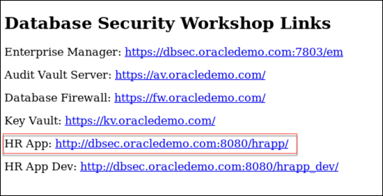

- You will notice the error, **‘Error while connecting to server!  Contact your administrator’**.  Since you have an active policy in enforcement from your previous lab exercise, all of the application traffic and attempts for the application user to connect to the database is considered **‘Unseen’** traffic—thus, it is being blocked as expected. 

  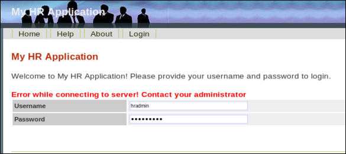

- You will now refine your policy to make an exception allowing SQL traffic from the HR application—the **EMPLOYEESEARCH** user.  Log in to the Audit Vault Server as **avauditor/Oracle123+**.  Click the **Policy** tab and then **Firewall Policy**.

  Take a few minutes to review the differences between policy No.2 and policy No.3. Pay particular attention to the Exception rules and note the differences there.

- Go to the **Secured Targets** tab, select your Secured Target – DBSec.  In the **Firewall Policy** section, switch to your newly revised Policy:

- Select **3 – Block with DBA and HR App Exception**, and click ‘Save’:

- You are now ready to see if you can log into the application. Return to the browser and attempt to login to the HR Application.

- Use the following credentials and click the Login button:  **hradmin/Oracle123**

    Notice that the change to your enforced policy now allows the application to work properly.  Now that the **EMPLOYEESEARCH** user can connect successfully to the database, the application can do its work.  You will see that you are logged into the application on the top right side of your screen.

    Even if you type in the password incorrectly, you will see that there is a different error message generated this time.

- Perform some “standard” activities in the HR application which you will then add to your existing whitelist of permitted activities. 
	
- Click **Search Employees** link on the right under the Employees section.

  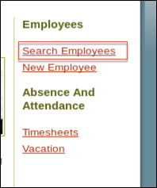

- Enter **%** in the Department field and click the **Search** button. Notice that **ALL employees** are returned, since you are logged in as hradmin. 

  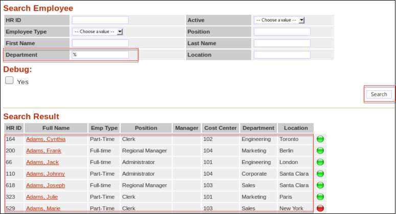

- Search for everyone in one department by entering **Engineering** in the Department field and hit **Enter**.

  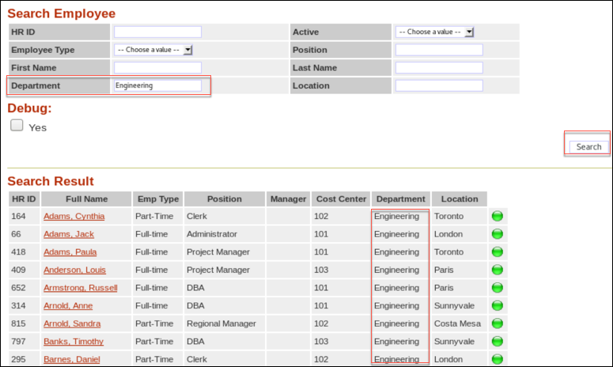

- Now log in as a different user, **malfoy/Oracle123**. Repeat the navigation and enter **%** in the Department field.

  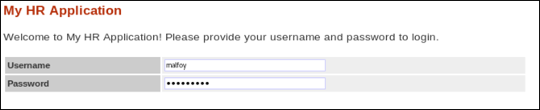

- Notice that all records returned are for the **Engineering** department, since the application enforces row level security.

  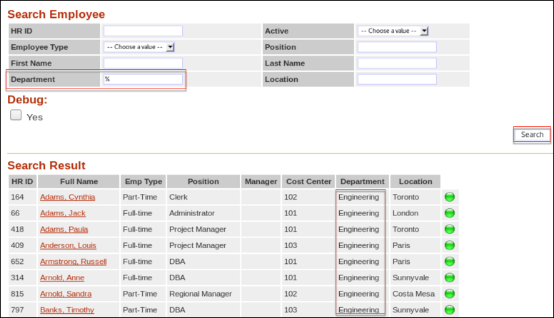

- Click the full name hyperlink **Borst, Hugo** to see his full details.

- Click **Logout** near the top left.

  You have now created traffic logs of “normal” and “expected” behavior in this application surrounding employee information searches.

  These statements have already been added to the whitelist policy **4 – Block with Updated Whitelist** for you

- Return to the Audit Vault Server, logging in as **avauditor/Oracle123+** if needed

- Navigate to **Policy / Firewall Policy** and select your current policy – **3 – Block with DBA and HR App Exception**. 

  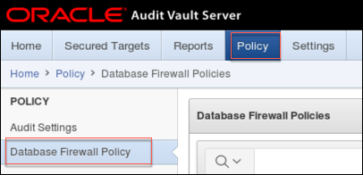

- Review the differences between **3 – Block with DBA and HR App Exception** and **4 – Block with Updated Whitelist**
  
  Note the HR App Exception has been removed from No.4 and that there are now more SQL Statements in the Analyzed SQL section. Click **Default** to review the SQL statements. Finally, note the Default policy settings at the bottom of the policy page and how we have defined a Statement Substitution such that the Firewall can silently alert on this out of policy activity while maintaining session integrity

  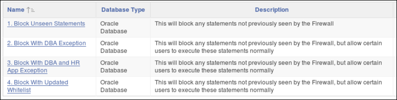
	 
- With policy **4 – Block with Updated Whitelist** in place, the HR Application will continue to function as all the statndard activity we generated in previous steps is allowed by the policy. Any new statemens executed by the application will be permitted.

- Before you implement this newly created policy based upon ‘expected’ traffic after the training process, first examine what you are hoping to prevent—unauthorized access to sensitive data using SQL Injection attacks. 

  As you did previously, to demonstrate that the **malfoy** user can view employee records in the Engineering department, click **Search Employees** link, and search for all employees with the first name **Frank**.  Three employees will be listed.

  Now you will demonstrate the vulnerability of this application against a SQL Injection attack.  Remember, many applications have been written (and not updated due to cost or effort) and continue to be written with the necessary coding standards to avoid (but not fully eliminate) these vulnerabilities.  

  In the Position field enter:

        ' UNION SELECT 1, username, 'test', '1', '1', '1', '1', '1', '1', 0, 0, PAYMENT_ACCT_NO, TAXPAYER_ID, sysdate, sysdate, '0', 1, '1', '1', 1 FROM hr.supplemental_data --

- **Note:** The 'tick' at the beginning and there is no space between the two dashes

- Since you have broken the application security by injecting your own SQL text into the application, all employees are listed.  And look at the sensitive data that is revealed!

    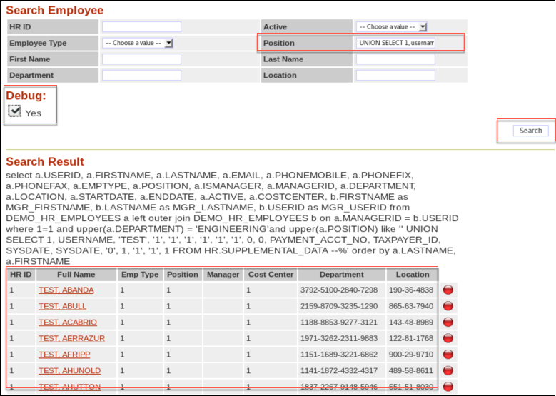

- Log out of the HR Application.	

- You will now implement your whitelist for the HR application to prevent this kind of attack—and the thousands of SQL Injection variations possible.  

- Log in to the Audit Vault Server as **avauditor/Oracle123+**.  Navigate to your Secured Target’s Firewall Policy and change the Firewall Policy to **4 – Block with Updated Whitelist**.

    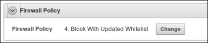

- Return to the HR Application, logging in as **malfoy/Oracle123** 

- Selecting **Employee Search** again.  

- Attempt to execute the search which previously resulted in the exposure of all records in the employees table, by entering:

    
        ' UNION SELECT 1, username, 'test', '1', '1', '1', '1', '1', '1', 0, 0, PAYMENT_ACCT_NO, TAXPAYER_ID, sysdate, sysdate, '0', 1, '1', '1', 1 FROM hr.supplemental_data --

- **Note:** The 'tick' at the beginning and there is no space between the two dashes

  This text may be found in the SQL_Injection text file in your lab folder and can be copied and pasted into the **Position** field.

  Since this query is not part of your whitelist, the entire statement fails.

    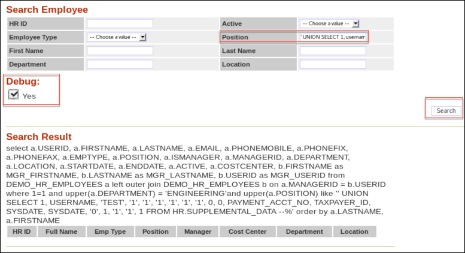

  Execute the statement a few times, then attempt some of the standard activity you generated earlier and note that this is still successful.

  Navigate to the Home page of the Audit Vault Server UI, and observe the Database Firewall Alerts which have been generated

    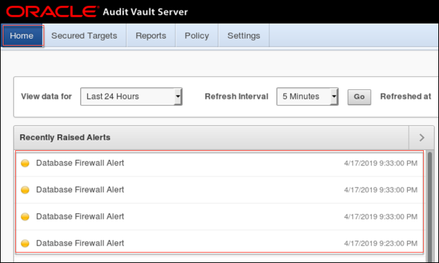

### SUMMARY

This demonstrates how Oracle Database Firewall can protect against SQL injection attacks without tedious, time consuming application development, validation, changes and testing.

One thing to note is that in this lab exercise, you performed just a few typical operations in the application. You will find that “normal” activity that you have not performed before the whitelist was created may be blocked.  In a “real” deployment, the whitelist would be developed by performing a full suite of regression testing.

### CONCLUSION

- You accomplished the following in this lab exercise:
  - Used exceptions to classify new traffic patterns.
  - Incrementally modified your baseline based on that traffic.
  - Updated your white list to prevent SQL Injection attacks.

**This completes the lab!**

---

[AVDF Landing Page](../README.md)

[Database Security Workshop Landing Page](https://github.com/kwazulu/dbsec-workshop/blob/master/README.md)