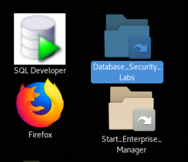
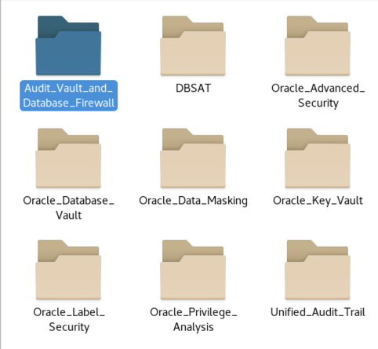
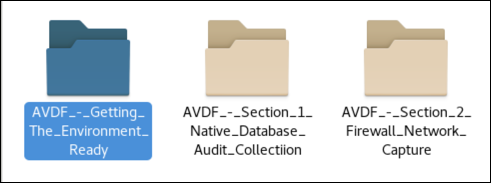
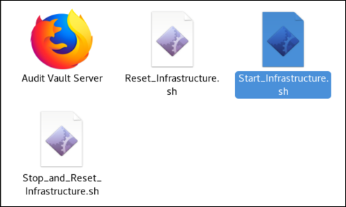
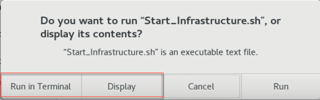

# Database Security Workshop: Audit Vault and Database Firewall

## Introduction

Oracle Audit Vault and Database Firewall provides a first line of defense for databases and consolidates audit data from databases, operating systems, and directories.  A highly accurate SQL grammar-based engine monitors and blocks unauthorized SQL traffic before it reaches the database.  Database activity data from the network is combined with detailed audit data for easy compliance reporting and alerting.  With Oracle Audit Vault and Database Firewall, auditing and monitoring controls can be easily tailored to meet enterprise security requirements.

  

***To log issues***, click here to go to the [github oracle](https://github.com/oracle/learning-library/issues/new) repository issue submission form.

## Required Artifacts

- The following lab requires:
  - Laptop (Windows, Mac or Linux)
  - VNC client

## Database Activity Monitoring

### **STEP 1**: Getting the environment ready

- On the Oracle Linux Desktop, navigate to the Database_Security_Labs folder, double-click and open the contents. 

  

- Select the folder, Audit_Vault_and_Database_Firewall.

  

- Select the folder, AVDF_-_Getting_The_Environment_Ready.

  

- In the AVDF_-_Getting_The_Environment_Ready folder, select Start_Infrastructure.sh.  This script will start the entire necessary infrastructure used in these lab exercises. In these lab exercises, use the Display button to view the contents of the scripts before executing.  This will allow you to review the steps, commands and scripts used in these exercises.  When executing scripts, use the Run in Terminal button.

  

  

- Please be patient as the infrastructure may take a little time to start.  Once the infrastructure has started, you are ready to move forward with the exercises.

## Labs

[Lab 100: MANAGING A DATABASE AUDIT POLICY](./100/README.md)

[Lab 200: REDUCE TIME TO COMPLIANCE USING ORACLE AUDIT VAULT REPORTING](./200/README.md)

[Lab 300: GAIN REAL-TIME DATABASE ACTIVITY MONITORING USING AUDIT VAULT AND DATABASE FIREWALL ALERTING](./300/README.md)

[Lab 400: CONFIGURE ORACLE DATABASE FIREWALL TO MONITOR AND PROTECT DATABASES](./400/README.md)

[Lab 500: USE ORACLE DATABASE FIREWALL TO CONFIGURE POLICIES AND BLOCK UNAUTHORIZED TRAFFIC](./500/README.md)

[Lab 600: ORACLE DATABASE FIREWALL – GAIN VISIBILITY AND SATISFY REQUIREMENTS THROUGH REPORTING](./600/README.md)

[Lab 700: ORACLE DATABASE FIREWALL – USING WHITELISTS TO PREVENT SQL INJECTION ATTACKS](./700/README.md)

--- 

[Database Security Workshop Landing Page](https://github.com/kwazulu/dbsec-workshop/blob/master/README.md)

