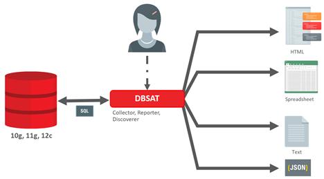
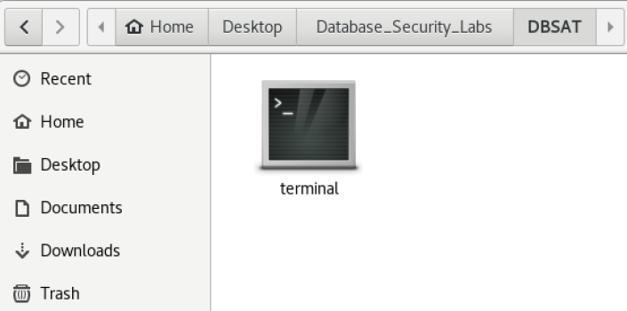
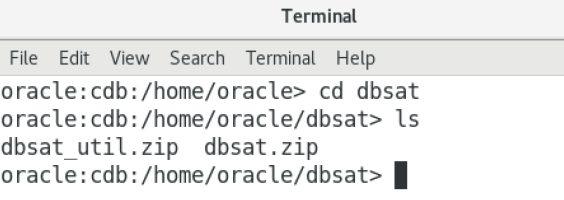
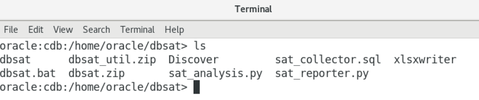
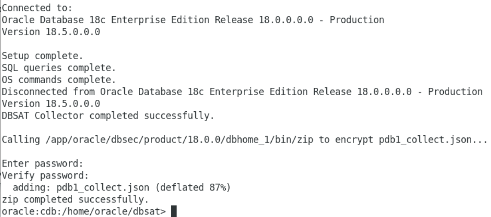
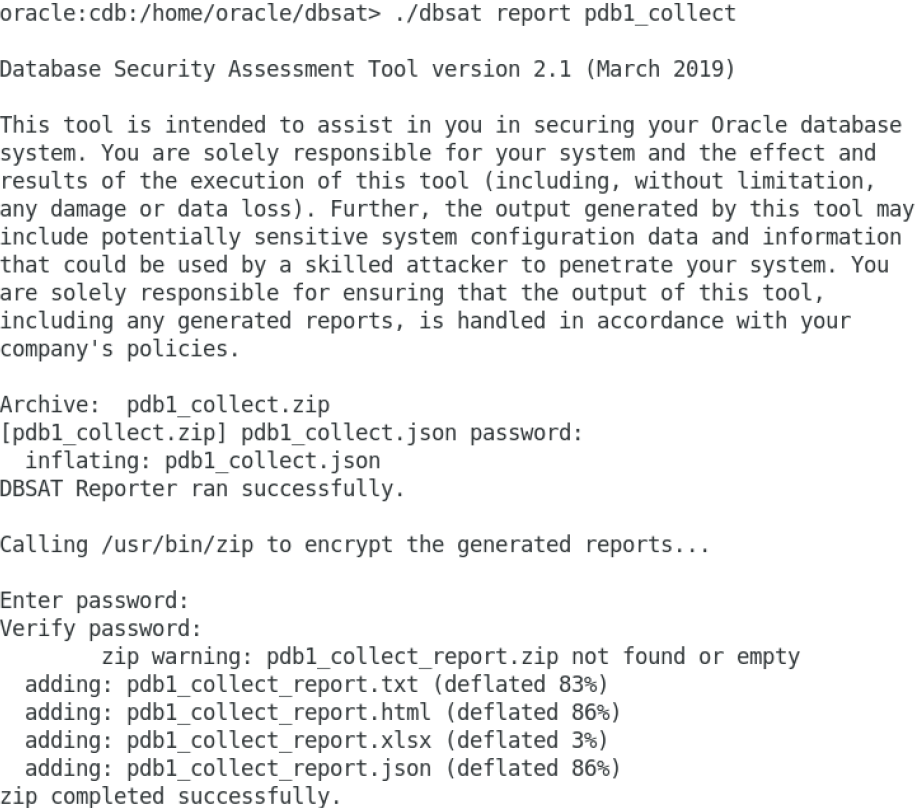
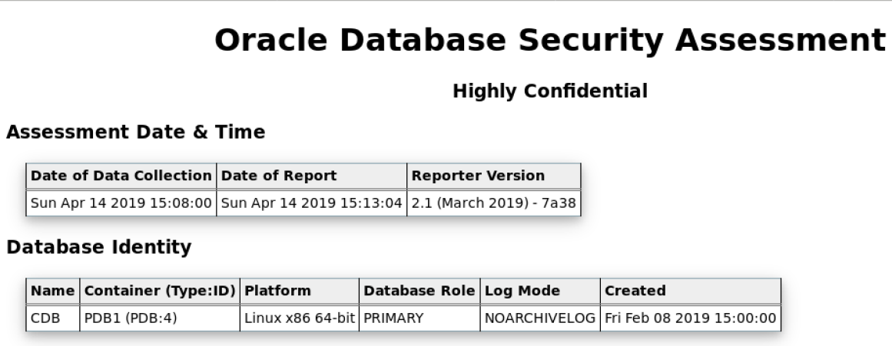
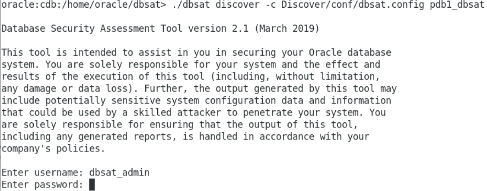
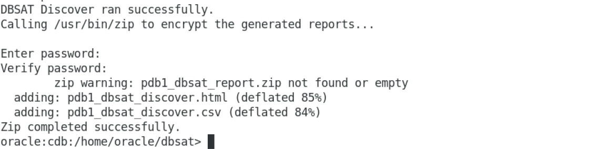

# Oracle  - Database Security Assessment Tool (DBSAT)

## Overview 

The Oracle Database Security Assessment Tool (DBSAT) helps identify sensitive data, analyzes database configurations, users, their entitlements and security policies to uncover security risks and improve the security posture of Oracle Databases within your organization.

You can use DBSAT to implement and enforce security best practices in your organization and accelerate compliance with regulations such as the EU GDPR. 

DBSAT reports on existing sensitive data, the state of user accounts, role and privilege grants, and policies that control the use of various security features in the database.

DBSAT generates two types of reports:
 - Database Security Risk Assessment report
 - Database Sensitive Data Assessment report

You can use report findings to:
 - Fix immediate short-term risks
 - Implement a comprehensive security strategy
 

## Components of DBSAT and Flow

      

DBSAT consists of three components, the DBSAT Collector, the DBSAT Reporter and the DBSAT Discoverer, that correspond to the functions of data collection, data analysis, and sensitive data discovery respectively:
- The **DBSAT Collector** executes SQL queries and runs operating system commands to collect data from the system to be assessed. It does this primarily by querying database dictionary views. The collected data is written to a file that is used by the DBSAT Reporter in the analysis phase.
- The **DBSAT Reporter** analyzes the collected data and reports its findings and recommendations in multiple formats: HTML, Excel, JSON, and Text. The Reporter can run on any machine: PC, laptop, or server. You are not limited to running it on the same server as the Collector.
- The **DBSAT Discoverer** executes SQL queries and collects data from the system to be assessed, based on the settings specified in the configuration files. It does this primarily by querying database dictionary views. The collected data is then used to generate a Database Sensitive Data Assessment Report in HTML and CSV formats. The CSV report can be loaded into Oracle Audit Vault and Database Firewall to add sensitive data context to the new Data Privacy reports. For more information about this functionality, see Importing Sensitive Data Into AVDF Repository in the Oracle Audit Vault and Database Firewall Auditor's Guide.
      
**Note:** The Discoverer can run on any machine: PC, laptop, or server. You are not limited to running the Discoverer on the database server or the same machine as the Collector and the Collector does not need to be run before executing DBSAT Discoverer.

## Benefits of Using DBSAT

You can use DBSAT to:

- Quickly identify sensitive data and security configuration errors in your databases
- Promote security best practices
- Improve the security posture of your Oracle Databases
- Reduce the attack surface and exposure to risk
- Provide input to auditors

## Installing DB Security Assessment Tool

Oracle Support Document 2138254.1 (Oracle Database Security Assessment Tool (DBSAT)) can be found at: https://support.oracle.com/epmos/faces/DocumentDisplay?id=2138254.1

**Note:** DBSAT has already been downloaded and unzipped in our Database Security Workshop. 

Once you have unzipped the tool you can see the commands available for dbsat discover a configuration file is needed. dbsat.config can be found in Discover/conf/ directory.

- From the Oracle Linux Desktop to the Workshop folder, Database Security Workshop, then DBSAT:

    

- Start the Oracle Container Database and Pluggable Database, pdb1, using this command from the terminal:

     $HOME/scripts/start_cdb.sh

- Move to the dbsat directory

    

- Unzip the dbsat.zip file

        unzip dbsat.zip

- It will look similar to this 

        

## Configuring and Executing the DBSAT Collection utility

- Ensure you are in the directory for the dbsat script

        cd /home/oracle/dbsat
        
- Execute the following command to see the options available at run-time

        ./dbsat
        
- Run DBSAT in collect mode

        ./dbsat collect dbsat_admin@pdb1 pdb1_collect
        
- When prompted, enter **Oracle123** as the password

- DBSAT will perform a connection and setup

    **Note:** It may take several minutes for the collection to complete.

- When complete, DBSAT will prompt you to enter a password for the zip file

    - Enter the password **Oracle123**
    
    

- You will see a zip file with the name we gave it during the collect process

        ls -al pdb1_collect.zip
        
**Note:** The next step is the reporting utility. You can choose to execute this on the same host or run it on a different host. If you are running DBSAT as part of a security assessment you may want to collect the results but not execute the report.
        
## Executing the DBSAT Report utility

- Using our newly-creaetd pdb1_collect.zip, run the reporting utility of DBSAT

        ./dbsat report pdb1_collect
        
    **Note:** You do not need to include the .zip extension
    
    - Enter the password for pdb1_collect.zip, which should be **Oracle123**
    
    - Enter the password for the new pdb1_collect_report.zip file as **Oracle123**
    
- Your output should look similar to this screenshot:

      

- Unzip the report zip to view the html file

    - The password should be **Oracle123**

            unzip pdb1_collect_report.zip

- View the HTML report in Firefox

        nohup firefox pdb1_collect_report.html &
        
- You are now viewing the Database Security Assessment Report

    

## Configuring and Executing the DBSAT Sensitive Data Discovery utility

- Copy the provided sample_dbsat.config, make the copy writable and open it for editing

        cd Discover/conf
        cp sample_dbsat.config dbsat.config
        chmod +w dbsat.config
        gedit dbsat.config &
        

- The configuration file includes comments that should be sufficient to understand what the various parameters do. In summary, this is where you can set up:

   - the Database connection details
   - the SSL parameters
   - the Discovery parameters
   - the Sensitive Categories and related risk level
 
 - Change the following variables to:

        DB_HOSTNAME = dbsec.oracledemo.com
        DB_SERVICE_NAME = pdb1.oracledemo.com
 
 - Save the file and go back to the shell.

- Let’s give it a try. Go back to the terminal and change directory to the dbsat home:

        cd ../..   

- Execute the discovery module:

        ./dbsat discover -c Discover/conf/dbsat.config pdb1_dbsat
        
- Pass **DBSAT_ADMIN** as the username and **Oracle123** as the password.

    

- At the end of the process, you’ll be asked to provide a password twice (please use Oracle123).

    

- A file named pdb1_dbsat_report.zip is created in the directory (/home/oracle/dbsat/).

- Unzip the file and check the contents by opening the HTML report in firefox

        unzip pdb1_dbsat_report.zip
        
- Launch the browser by typing

        nohup firefox pdb1_dbsat_discover.html &
        
- Firefox opens with the **Database Sensitive Data Assessment** report as shown below:

## Analyze the generated Discoverer report - Summary

In this exercise, you will learn how to analyze the Sensitive Data Assessment Report. We will dive into the different sections of the report and in subsequent exercises in more detail about the value the discovery parameters provide.

Please take a couple of minutes to scroll through the HTML report. You can use the navigation arrows at the bottom right to navigate between different sections.

- Initial Section

- At the top of the report, you will find information about the Discoverer run details as the Date of DBSAT Report Generation along with the DBSAT Discoverer version.
- Follows the Database Identity information where you will find details about the target database.
This section may vary depending on whether dbsat connects to a non-CDB, CDB or PDB.
- Then the Discovery Parameters table. The Discover Parameters table shows the parameters in use from the dbsat.config file.

- Schemas Scope=ALL

    - Enables to choose if the search takes all schemas into account (except SYS, SYSTEM and other Oracle maintained schemas) or a limited set of comma-separated schemas. By default, ALL will target all schemas and will discover accordingly. 

- Exclusion List File = NONE

    - Allows to exclude from the results all tables from a schema (schemaD), a whole table (schemaA.tableA), or certain columns (schemaA.tableB.columnA ; schemaB.tableA.columnC).

- Minimum Rows Count = [1 (default)]

Exclude tables with less than X rows from the result set. This enables to exclude tables with less than a certain number of rows. This argument is used to define the weight of tables to be considered by the discoverer. It enables to produce a smaller and more focused report.
Pattern File(s) = [sensitive.ini (default), other.ini, …]
By default, sensitive_en.ini is used, and it contains patterns in English and will look for English based sensitive columns/comments. This parameter enables the end user to choose which sensitive pattern files to add to the search. 

If you want to search the data model in other languages, please reach out to your Oracle Account Manager. Oracle can help you to get a head start by providing sample pattern files in other languages. 

You can create your own pattern files.

**Note:** Pattern files need to be located in the same directory sat the dbsat.config file

- Summary Table

    - The Summary will show you, organized by Sensitive Category, the number of tables, the number of columns and the number of rows.
    
- Sensitive Data section

- Schema View

# [Database Security Workshop Landing Page](https://github.com/kwazulu/dbsec-workshop/blob/master/README.md)
    

        
        

