# Database Security Workshop: Data Masking

## LAB EXERCISE 100 – CREATING AN APPLICATION DATA MODEL (ADM)

- Login to Enterprise Manager as SYSMAN / Oracle123 

- Navigate to the Application Data Models page like this:
    - Select the tab Enterprise
    - Select Quality Management 
    - Select Application Data Models

- Briefly review the Secure Test Data Management diagram to familiarize yourself with the process. 

- Click Create

    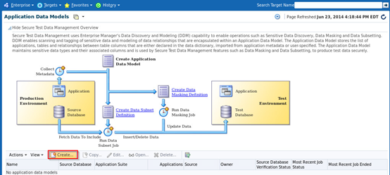

- You will create a new ADM called Employee Data on the pdb1 database.
    - Notice the options to create ADMs for Oracle Enterprise Business Suite (EBS) and Fusion Applications
    
- Chose the option type, **Custom Application Suite** and checkbox the option, **Create One Application For Each Schema** (default)

- Name the ADM: **EmpSearch Data**
    - Click the spyglass for Source Database and select **cdb_PDB1**
    
        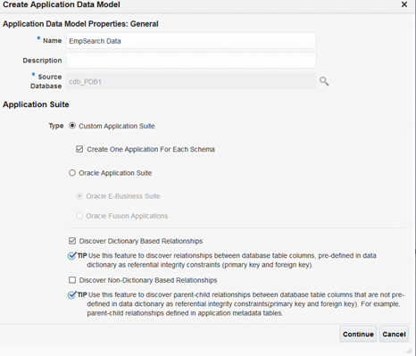

- Login to the PDB1 database as MASKING_ADMIN / Oracle123

    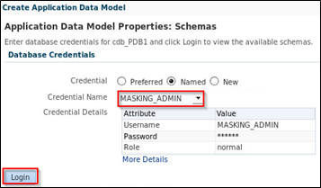

- Select the **EMPLOYEESEARCH_DEV** schema for the application data model and then click the Continue

    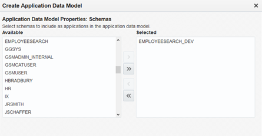
    
- Click the Submit button to schedule the job

    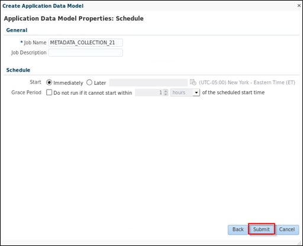
    
    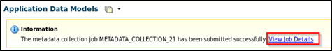
    
- Once the job completes, the EMPLOYEESEARCH_DEV ADM will no longer be in a locked, uneditable, status.

    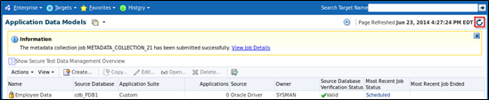
    
- Highlight the ‘Employee Data’ Application Data Model and click the ‘Edit’ button.  

    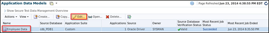

- You may be asked for database credentials.  Select NAMED crdentials and choose MASKING_ADMIN

    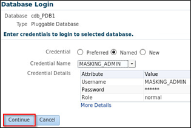
    
- In the Edit Application Data Model: Employee Data screen, notice the applications for EMPLOYEESEARCH_DEV have been created based on the schema. Under the menu View, select the sub-menu Expand All to see the full list of tables associated with these applications

    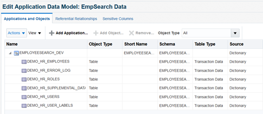
    
- Now view the referential relationships captured in the ADM.  Click the tab, ‘Referential Relationships’.  Expand the entire list of applications (Menu View à Submenu Expand All) to examine the referential relationships under each application.  Now that Cloud Control is aware of the foreign keys, it will automatically apply the same format masks to child tables.

    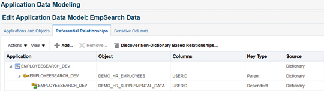
    
**NOTE:** If there is not defined referntial integrity, the Data Masking Pack provides administrators with the ability to register these relationships so that the columns in the related tables (e.g. USERID in the DEMO_HR_USERS and DEMO_HR_ROLES tables) are masked identically using the same masking rules.

#### Summary

In this lab, you used Oracle Data Masking and Subsetting to perform the following:

- Create an Application Data Model.
- Viewed the referential relationships and saw the primary key and foreign key relationships captured.
- Learned how referential relationships not included in the Data Dictionary (typically those enforced in Application code) can be added manually.

**This completes this Lab!**

--- 

[Next Lab](../200/README.md)

[DMS Landing Page](../README.md)

[Database Security Workshop Landing Page](https://github.com/kwazulu/dbsec-workshop/blob/master/README.md)
