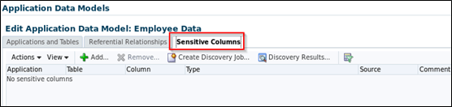

# Database Security Workshop: Data Masking

## Introduction

This is the one of several labs which are part of **Oracle Database Security Workshop.** This workshop will walk you through the process configuring, validating and using all of Oracle's Database Security products

### Sensitive Data Discovery

Today’s enterprise applications have very complex database schema often containing hundreds or thousands of database objects. Administrators have a daunting and time consuming job of identifying all tables and columns containing confidential or sensitive. Fortunately, Oracle Data Masking Pack makes this task easy through the built-in search function that allows the information security administrator to query the entire data dictionary to identify potential tables and columns containing sensitive data.
This functionality may be utilized by your customers who license any of your Database Security products.  For example, this capability may assist Audit Vault users with identifying candidates for Fine Grained Audit policies.

## LAB EXERCISE 200 – IDENTIFYING SENSITIVE DATA

- Login to Enterprise Manager as SYSMAN / Oracle123 

- Navigate to the Application Data Models page like 
    - Click Enterprise
    - Quality Management
    - Application Data Models
    
    
    
- Look at the list of Sensitive Column Types.  Click the menu **Actions** and select the sub-menu **Sensitive Column Types**.  

    
    
- Review the Sensitive Column Discovery Templates that are shipped by default with the Data Masking Pack.  As an example, review the EMAIL_ID template by hovering over the name **EMAIL_ID**.  When using this Sensitive Column Type will:
    - Search for ‘EMAIL’ or ‘MAIL’ in the Column Name
    - Ssearch for ‘EMAIL’ or ‘MAIL’ in the Column Comment 
    - Apply a regular expression pattern match to all of the Column Data if the user (i.e. MASKING_ADMIN) has access to the data.  
    
    **Note:** This process uses Oracle Regular Expressions which is compatible with the IEEE Portable Operating System Interface (POSIX) regular expression standard and to the Unicode Regular Expression Guidelines of the Unicode Consortium.  In this case, the Search Type has been set as an ‘Or’ condition, so if any of the conditions listed above are met, it will result in a match.

    
   
- Create a custom Sensitive Column Type.  Click the **Create** button to start the process.

    

- Create a Sensitive Column Type that will look for the wildcard **NAME** as part of the Column Name or the Column Comment. Complete the following dialog with the provided information and click the OK button to submit.

        Name: NAMES
        Description: Search for NAME in either the Column Name or in the Column Comment
        Column Name: *NAME*
        Column Comment: *NAME*

    
    
    
    
- Navigate back to the Data Discovery and Modeling page from the Quality Management dashboard.

- Select the **Employee Data** Application Data Model and click Edit

    

- On the Edit Application Data Model: Employee screen, click the **Sensitive Columns** tab.

    
    
- Currently, there are no sensitive columns discovered so you must initiate a search.  
    - Click **Create Discovery Job**
    
- Provide the parameters for the sensitive columns discovery job.  Choose the EMPLOYEESEARCH_DEV schema and choose the all of them except ISBN_10, ISBN_13, and UNIVERSAL_PRODUCT_CODE Sensitive Column Types.  Click the ‘Continue’ button to perform the search.

    
    
- After clicking the **Continue** button, provide the Job information and click the **Submit** button to run the job based upon the options selected

    **NOTE** If this was a complex job with a large data set, you might want to track the progress of the job as suggested at the top of the screen. 

- Click **Discovery Results** 

    
    
- Click **View** then **Expand All** to review the Sensitive Column Discovery Results
    - Notice that the Sensitive Status of these columns is currently set to **Undefined**. 

        
    
- For this lab, select the PAYMENT_ACCT_NO,  FIRST_NAME, LAST_NAME and TAXPAYER_ID.
    - Set the sensitive status of several columns to **Sensitive** that you want to mask. 
    - Select each identified sensitive column entry and click **Set Sensitive Status** menu item and then pick **Sensitive** sub menu item. 
    - Upon successful completion, you should see all **Undefined** labels toggle to **Sensitive**.   

      
      
    - After closing the window it will look like this image:
    
      
    

#### Summary

In this lab, you used Oracle Data Masking and Subsetting to perform the following:

- Identified and used pre-defined Sensitive Column Types
- Created a new Sensitive Column Type and applied it to certain columns
- Manually identified a Sensitive Column 

**This completes this Lab!**

--- 

[DMS Landing Page](../README.md)

[Database Security Workshop Landing Page](https://github.com/kwazulu/dbsec-workshop/blob/master/README.md)
