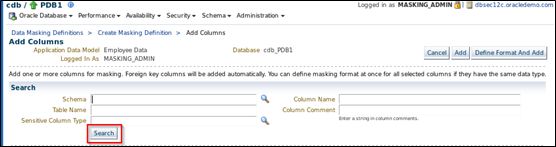
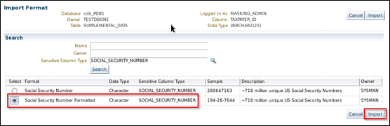

# Database Security Workshop: Data Masking

## Introduction

This is the one of several labs which are part of **Oracle Database Security Workshop.** This workshop will walk you through the process configuring, validating and using all of Oracle's Database Security products

### Sensitive Data Discovery

This lab focuses on the DEMO_HR_EMPLOYEES and related tables, with the goal of protecting Personally Identifiable Information (PII) from outside developers who work on their HR Application.
A data masking definition is the association of tables and columns in a set of schema with masking format. The Data Masking definition contains a list of sensitive columns in the application tables, e.g. employee social security numbers, and its corresponding association with data masking formats, e.g. a fake social security number generator. In this example, you will choose the sensitive columns in your associated tables and then associate them with your masking formats.

## LAB EXERCISE 300 – MASKING SENSITIVE APPLICATION DATA

- Login to Enterprise Manager as SYSMAN / Oracle123 

- Navigate to the Application Data Models page like 
    - Click Enterprise
    - Quality Management
    - Data Masking Definitions
    
        
    
- From the Data Masking Definitions Dialog, you will create a new definition.  Click the Create button to begin the process of masking data.

    
    
- From the Create Masking Definition screen, fill in the Name, Application Data Model and Description field with the provided values below. Then click the Add button

        Name: 	 		EMPLOYEE_DATA_MASK
        Application Data Model:  	EmpSearch Data
        Reference Database:		<Will be filled in for you>
        Description:			Mask EMPLOYEESEARCH_DEV Data
    
    - The screenshot should look similar:

        
        
- Click the magnifier glass icon to the Search and Select screen.  Select the ‘Employee Data’ Application Data Model and click the Select button.

    
    
- The Reference Database will default to the ‘cdb_PDB1’ database.  Click the OK button to continue.

    
    
- Now add the columns to your masking definition.  Click the highlighted Add button.

    
    
- At the Database Login screen, choose the Named Credential for MASKING_ADMIN and click the Login button.

    
    
- You are going to search for all of the identified and tagged ‘sensitive’ columns in the previous lab exercise.  Click the Search button.

    
    
- Click **Select All** and click the **Add** button

    
    
- The next step is to format the FIRSTNAME column.  Continue by clicking on the wrench icon:  

- As previously discussed, there are many different options to format the column of data to ensure the quality of the data masking.  If you were to use an existing format from the Format Library, you would click the Import Format button.  In this particular example, you are going to select Shuffle from the drop down list box and click the Add button.

    
    
- Repeat the same procedure and apply the Shuffle format to LAST_NAME.

    
    
- Now apply a format to the CREDIT_CARD column. 

- In this example, you are going to use one of the formats that Oracle Provides-- the Generic Credit Card.  Click the Import Format button and then select Generic Credit Card.

- You will see what the format looks like

    
    
- For the last column repeat the same steps and use the “Social Security Number Formatted” format masking provide by the Oracle Data Masking pack.

    
    
    

**Note:** Make sure all of the Format columns have a blue wrench icon instead of the red wrench icon.
    

- Review that you have successfully created a Data Masking Definition

    
- Before you generate the Script to mask data, query the existing unmasked data so that you compare the results after you mask the data.  
    - Open a new Firefox tab 
    - Click “HR App Dev” bookmark 
    - Log in using the credentials: hradmin/Oracle123

- Navigate back to Data Masking Definition page and click **Generate Script**

    

-  After clicking on the Generate Script button, the data masking script will be generated.  You may be prompted to log back into the database with Named Credentials.    

- Make sure you select **Mask In-Database** for this example
    - Click Start Immediately and Submit
    
    
    
- To view the status of your job, you can follow the prompts provided by Enterprise Manager Cloud Control.  Once the job has been successfully generated, navigate back to your Data Masking Job, you are ready to submit it.  You can refresh the screen by clicking on the Go button.

    

- You may be forwarded to the Script Generation Results page.  There are a number of areas to explore and drill into. You can click **View Script** or you can **Download Script**

    

- Return to the Data Masking Definitions screen and click the Schedule Job button to immediately schedule and run the masking operation.  

    
    
- Next, we will mask the data. Ensure you check the following:
    - Mask In-Database
    - The selected target is not a production database
    - Named Credentials
        - OS_ORACLE
        - MASKING_ADMIN

    

- When you are ready, click **Submit**

- Once you submit the job, you will be forwarded to a confirmation page that the job was submitted successfully.  Click the Go button to refresh the status of the job.

    
    
- Once the job successfully completes, follow the provided steps again to create a new tab and query the masked data in the Development and Production applications for a before and after comparison.

- Toggle between the two browser tabs and review the data before the masking job and after the successful masking operation of the four columns defined in the mask.

Note: You will see Script Generation Options. Please choose In-Place Masking. 
    
#### Summary

In this lab, you used Oracle Data Masking and Subsetting to perform the following:

- Created a Data Masking Definition to mask the DEMO_HR_EMPLOYEES data
- Formatted columns using the Format Library and Masking Formats
- Generated data masking scripts
- Executed the data masking script
- Compared the pre-masked data vs. the post-masked data

**This completes this Lab!**

- [Database Security Workshop Landing Page](https://github.com/kwazulu/dbsec-workshop/blob/master/README.md)