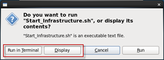

# Database Security Workshop: Data Masking

## Introduction

This is the one of several labs which are part of **Oracle Database Security Workshop.** This workshop will walk you through the process configuring, validating and using all of Oracle's Database Security products

### Data Masking

Oracle Data Masking pack for Enterprise Manager, part of Oracle's comprehensive portfolio of database security solutions, helps organizations comply with data privacy and protection mandates such as Sarbanes-Oxley (SOX), Payment Card Industry (PCI) Data Security Standard (DSS), Health Insurance Portability and Accountability Act (HIPAA), EU General Data Protection Regulation (GDPR), and the upcoming California Consumer Privacy Act (CCPA), and numerous laws that restrict the use of actual customer data. With Oracle Data Masking, sensitive information such as credit card or social security numbers can be replaced with realistic values, allowing production data to be safely used for development, testing, or sharing with out-sourced or off-shore partners for other non-production purposes. Oracle Data Masking uses a library of templates and format rules, consistently transforming data in order to maintain referential integrity for applications.

Data masking (also known as data scrambling and data anonymization) is the process of replacing sensitive information copied from production databases to test or non-production databases with realistic, but scrubbed, data based on masking rules. Data masking is ideal for virtually any situation when confidential or regulated data needs to be shared with other non-production users; for instance, internal users such as application developers, or external business partners, like offshore testing companies or suppliers and customers. These non-production users need to access some of the original data, but do not need to see every column of every table, especially when the information is protected by government regulations. 

Data masking allows organizations to generate realistic and fully functional data with similar characteristics as the original data to replace sensitive or confidential information. This contrasts with encryption or Virtual Private Database, which simply hide data, allowing the original data to be retrieved with the appropriate access or key.  With data masking, the original sensitive data cannot be retrieved or accessed.  Names, addresses, phone numbers, and credit card details are examples of data that require protection of the information content from inappropriate visibility. Live production database environments contain valuable and confidential data — access to this information is tightly controlled. However, each production system usually has replicated development copies, and the controls on such test environments are less stringent. This greatly increases the risks that the data might be used inappropriately. Data masking can modify sensitive database records so that they remain usable, but contain no confidential or personally identifiable information. Yet, the masked test data resembles the original in appearance to ensure the integrity of the application. 

# Getting Started

***To log issues***, click here to go to the [github oracle](https://github.com/kwazulu/dbsec-workshop/issues/new) repository issue submission form.

## Required Artifacts

- The following lab requires:
  - Laptop (Windows, Mac or Linux)
  - Internet Access
  - Oracle VPN/SSL Array Connectivity
  - VNC

##	Here is a summary of the users used in these labs.
  - SYSMAN / Oracle123 - Enterprise Manager (EM) user
  -	SYS / Oracle123     – User with DBA Rights
  - DBA_DEBRA / Oracle123 – Sr. Database Administrator
  - DBA_NICOLE  / Oracle123 – Jr. Database Administrator
  - EMPLOYEESEARCH / Oracle123 - Application Owner
  - MASKING_ADMIN / Oracle123 - Masking Administrator who will perform masking operations in EM

###	OS Accounts and Passwords
  -	oracle / Oracle123
  - root / Oracle123

###	If accessing via VNC
 - :2 (5902) - oracle / Oracle123
 - :1 (5901) - root / Oracle123

### LAB SETUP

- For a good navigational experience, you may want to access Enterprise Manager Cloud Control from your own LOCAL browser.  The URL is https://<your ip>:7803/em with the username: sysman and the password: Oracle123. This will not work if you are connected to the Array/SSL VPN. 

- This database has a cdb instance and pluggable database instance pdb1.  You are going to create a masking job for pdb1 as if it were a development database.  There is a schema named EMPLOYEESEARCH_DEV which owns copies of all of the HR schema's objects.

- On the Oracle Linux Desktop, navigate to the DB_Security_Labs folder, double-click and open the contents.

- Select the folder, Oracle_Data_Masking.

- Select the folder, DM_-_Getting_the_Environment_Ready.  

- In the DM_-_Getting_the_Environment_Ready folder, select Start_DM_Infrastructure.sh.  This script will start the infrastructure used in these lab exercises.

    

***Notes*** In these lab exercises, use the Display button to view the contents of the scripts before executing.  This will allow you to review the steps, commands and scripts used in these exercises.  Use the Run in Terminal button to execute the script.

- Once the infrastructure has started, you are ready to move forward with the exercises.

## Labs

[LAB EXERCISE 100 – CREATING AN APPLICATION DATA MODEL (ADM)
](100%2FREADME.md)

[LAB EXERCISE 200 – IDENTIFYING SENSITIVE DATA
](200%2FREADME.md)

[LAB EXERCISE 300 – MASKING SENSITIVE APPLICATION DATA
](300%2FREADME.md)

--- 

[Database Security Workshop Landing Page](https://github.com/kwazulu/dbsec-workshop/blob/master/README.md)

