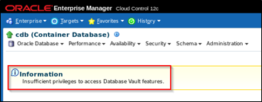
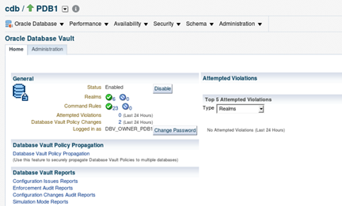

# Database Security Workshop: Database Vault

# Getting Started

***To log issues***, click here to go to the [github oracle](https://github.com/kwazulu/dbsec-workshop/issues/new) repository issue submission form.

## LAB EXERCISE 01 – PROTECTING SENSITIVE DATA FROM PRIVILEGED USER ACCESS USING ORACLE DATABASE VAULT REALMS

Access the lab exercise folders to begin.  On the desktop, navigate to the Database_Security_Workshop folder, double-click and open the contents.

- Select the folder, Oracle_Database_Vault.

- Select the folder, DBV_-_Getting_The_Environment_Ready.  

- In the DBV_-_Getting_The_Environment_Ready folder, select Start_Infrastructure.sh.  This script will start the necessary infrastructure used in these lab exercises.

    ***In these lab exercises***, use the Display button to view the contents of the scripts before executing.  This will allow you to review the steps, commands and scripts used in these exercises.  When executing scripts, use the Run in Terminal button.

- Once the infrastructure has started, you are ready to move forward with the exercises.

- Navigate and open the folder, DBV_Lab_Exercise_01.

- First, examine the access of the SYSDBA user before you implement a Database Vault Realm.  
    - Double click the  the 01_Login – Oracle Enterprise Manager icon to launch Enterprise Manager.

- Login to Enterprise Manager as SYSMAN / Oracle123

- In the Search List, expand the list (CDB  Pluggable Databases) and select cdb_PDB1 from the list of pluggable database

- In the Database Login screen, select the Named user, SYS (sys / as SYSDBA) and click the Login button.

- Type in the schema name, EMPLOYEESEARCH in the Schema entry field and click the Go button.

- Select the DEMO_HR_EMPLOYEES table then select View Data from the dropdown list.  Click the Go button to proceed.
        
        
-  As expected, the SYSDBA was able to select from the EMPLOYEESEARCH.DEMO_HR_EMPLOYEES table.  

    

***The next steps*** will guide you through the process of creating a Realm to protect the EMPLOYEESEARCH schema.  Access the Oracle Database Vault administration screens by navigating to Security -> Oracle Database Vault

- The SYSDBA does not have privileges to access Database Vault administration.  Only a user with the DVOWNER role can access Database Vault.

    

- Log Out as the SYSDBA by clicking "SYSMAN" at the top-right of the EM page
    - Click "Log Out" 
    - Choose "logoutof PDB1 (Pluggable Database)"
    - Click Logout
    
***In future steps***, use this logout/login method to sign in as different users to review the expected behavior in changes with the use of Database Vault Realms enabled

- Navigate to the PDB Security page.
    - Click Security
    - Click Database Vault
    
    
       
- Login as the pdb1 Database Vault owner, DBV_OWNER_PDB1 and click the Login button.  

    

- You can see there is a log of information on the ***Oracle Database Vault** dashboard. 

    

- Select the Database Vault Administration tab then click the Create button to create your first Realm.

    
    
- Create a realm called EMPLOYEESEARCH_DATA provide a comment and click the Next button.

    
    
- Add Realm Secured Objects. 
    - Click the Add button and provide EMPLOYEESEARCH as the schema name and % for both Object Type and Object Name, thus selecting all objects in the schema.  
    - Click OK and then the Next for the next step.  

    
    
- Add the Realm Authorizations by clicking the Add button. Perform the following:
    - DBA_HARVEY as a Participant 
    - EMPLOYEESEARCH as an Owner

    
    
    
    
    
    
- Click the Next button to review and after reviewing the Create Realm: Review page, click the Finish button.    
    
    
    
- You can now test your newly-created realm. Logout again and Login as SYSDBA to the Database Target PDB1 as you did earlier in the exercise     

    
    
    
    
    
    
    
    
- Try again to SELECT from the EMPLOYEESEARCH schema as earlier. You will notice you now get an insufficient privileges error indicating that even DBA accounts are locked out of the newly created protective Realm.

    
    
    
    
- If you want, you can try other options in the drop-down. You should be able to gather statistics or view the table structure even without the ability to perform SELECT or DML. 
    
- Logout again and login again as DBA_HARVEY. Remember that DBA_HARVEY was an authorized user of the Realm now protecting the EMPLOYEESEARCH schema.  Select from EMPLOYEESEARCH schema again and notice that DBA_HARVEY can access the data as a participant in the EMPLOYEESEARCH_DATA realm.

    
    
    
    
- Finally, you will access the HR Application that uses the EMPLOYEESEARCH schema.   Choose the bookmark highlighted below or access the application with the following URL:  http://dbsec.oracledemo.com:8080/hrapp/

- Login using the credentials hradmin/Oracle123.  

    

- After logging in, click the Search button with no criteria to query all the records.  Notice that user hradmin can select data from the Employee Search Application because the application grants access through explicit roles and the EMPLOYEESEARCH schema. 

    
    
 #### Conclusion

In this lab, you used Database Vault to create a Realm (a layer of protection against DML, DDL, DCL) around the EMPLOYEESEARCH schema and objects. 

**This completes this Lab!**

--- 

[Database Vault Landing Page](../README.md)

[Database Security Workshop Landing Page](https://github.com/kwazulu/dbsec-workshop/blob/master/README.md)