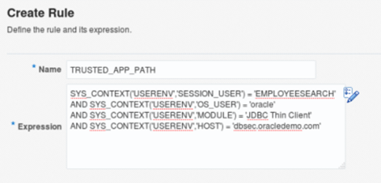
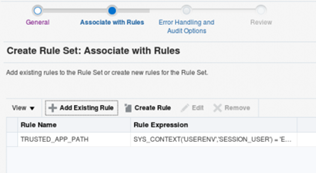
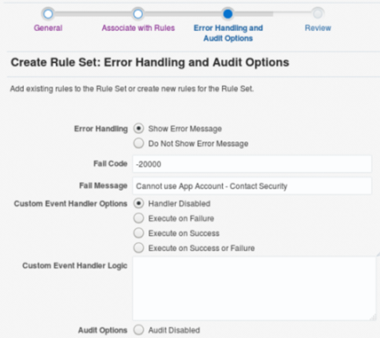
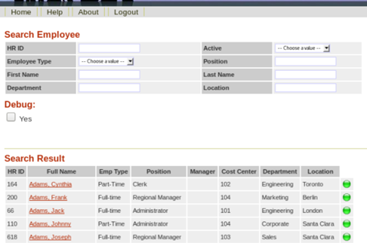
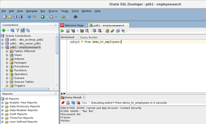

# Database Security Workshop: Database Vault

## Introduction

This is one of several labs which are part of **Oracle Database Security Workshop.** This workshop will walk you through the process configuring, validating and using all of Oracle's Database Security products

### Oracle Database Vault Multi-Factor Authorization

Oracle Database Vault Multi-Factor Authorization extends access controls beyond the traditional role based and even more sophisticated label based access control found in the Oracle Database. Using multi-factor authorization, access to databases can be restricted to a specific subnet or application server, creating a virtual trusted path for data access. Limiting data access to approved applications can be achieved using Oracle Database Vault factors in combination with Oracle Database Vault Realms or Command Rules. 

The Oracle Database, and Oracle Database Vault, provides a number of built-in Factors, such as IP address, that can be used individually or together in combination with other security rules to significantly raise the level security for an existing application. In addition to the built-in Factors provided by Database Vault, you can add custom factors to meet your own business requirements.

# Getting Started

***To log issues***, click here to go to the [github oracle](https://github.com/kwazulu/dbsec-workshop/issues/new) repository issue submission form.

##	Here is a summary of the users used in these labs.
  -	DBV_OWNER_PDB1 / Oracle123 – User with DVOWNER role to manage Database Vault security policies
  -	SYS / Oracle123     – User with DBA Rights
  - DBA_DEBRA / Oracle123 – Sr. Database Administrator
  - DBA_NICOLE  / Oracle123 – Jr. Database Administrator
  - EMPLOYEESEARCH / Oracle123 - Application Owner

###	OS Accounts and Passwords
  -	oracle / Oracle123
  - root / Oracle123

###	If accessing via VNC
 - :2 (5702) - oracle / Oracle123
 - :1 (5701) - root / Oracle123

## LAB EXERCISE 200 – ENFORCING OPERATIONAL CONTROLS USING ORACLE DATABASE VAULT MULTI-FACTOR AUTHORIZATION

Access the lab exercise folders to begin.  On the desktop, navigate to the Database_Security_Workshop folder, double-click and open the contents.

- Select the folder, Oracle_Database_Vault.

    ***In these lab exercises***, use the Display button to view the contents of the scripts before executing.  This will allow you to review the steps, commands and scripts used in these exercises.  When executing scripts, use the Run in Terminal button.

- Once the infrastructure has started, you are ready to move forward with the exercises.

- Navigate and open the folder, DBV_Lab_Exercise_02.

- In this lab, you will use EMPLOYEESEARCH and DBA_DEBRA to demonstrate how rules can be established to control levels of access within Oracle Database Vault. Start by modifying the EMPLOYEESEARCH_DATA realm.  Login to the Database Vault owner account ‘dbv_owner_pdb1’.  Click the Administration tab

- On the Administration Home page and select Rules from the menu on the left.

- In the Create Rule screen, provide the Name (TRUSTED_APP_PATH) and click OK 

    
    
    You can copy and paste the following into the expression text area:
    
         SYS_CONTEXT('USERENV','SESSION_USER') = 'EMPLOYEESEARCH' 
         AND SYS_CONTEXT('USERENV','OS_USER') = 'oracle' 
         AND SYS_CONTEXT('USERENV','MODULE') = 'JDBC Thin Client' 
         AND SYS_CONTEXT('USERENV','HOST') = 'dbsec.oracledemo.com'
         
- Click Rule Sets and Create a new Rule Set

- Name the Rule Set "HR Application Rules" 

- Set the Rule Set to Static, Enabled and click Next

    

- Click ***Next*** and you will notice you can configure error handling and auditing options

    
    
- Next, edit the Oracle Database Vault Realm we created in the previous lab

- Navigate to Realms, highlight the Realm Name, and click Edit

- On Step 3, edit the Realm Authorized Grantee, EMPLOYEESEARCH, and add the PROTECT_EMPSEARCH Rule Set to EMPLOYEESEARCH.  This action further restricts how EMPLOYEESEARCH can be used. 

    
    
- Open a browser and navigate to the HR Application at http://dbsec.oracledemo.com:8080/hrapp

- Login to the HR Application as hradmin/Oracle. 
    - Notice the user can successfully view the EMPLOYEE_SEARCH data still

    

- Next, launch SQL Developer and login as EMPLOYEESEARCH.

- Execute the following query as EMPLOYEESEARCH

        select * from demo_hr_employees;
        
- You should receive an error preventing you from using EMPLOYEESEARCH and querying it's own data.

    
    
#### Conclusion

In this lab, you used Database Vault to extend the Realm by using Oracle Database Vault Rules and Rule Sets. 

**This completes this Lab!**

--- 

[Database Vault Landing Page](../README.md)

[Database Security Workshop Landing Page](https://github.com/kwazulu/dbsec-workshop/blob/master/README.md)