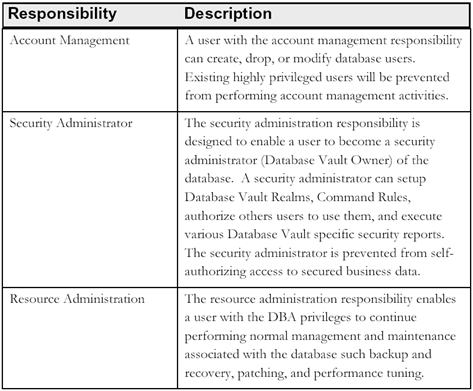

# Database Security Workshop: Database Vault

## Introduction

This is the first of several labs which are part of **Oracle Database Security Workshop.** This workshop will walk you through the process configuring, validating and using all of Oracle's Database Security products

### Highly Privileged User Controls

Database administrators and other highly privileged users play a critical role in maintaining the database. Backup and recovery, performance turning, and high availability are all part of the DBA job description. However, the ability to prevent highly privileged users within the database from viewing sensitive application data has become an increasingly important requirement. In addition, application consolidation requires strong boundaries between sensitive business data such as that found in financial and human resource applications.

### Oracle Database Vault Realms

Oracle Database Vault Realms prevent DBAs, application owners, and other privileged users from viewing application data using their powerful privileges.  Database Vault Realms put in place preventive controls, helping reduce the potential impact when a data breach does occur, enabling the DBA to perform his or her job more effectively. Oracle Database Vault Realms can be used to protect an entire application or a specific set of tables within an application, providing highly flexible and adaptable security enforcement. 

### Oracle Database Vault Separation of Duty

Oracle Database Vault separation of duty enables a systematic approach to security that strengthens internal controls within the database. Out-of-the-box, Oracle Database Vault creates three distinct responsibilities within the database.

Oracle Database Vault extensibility allows separation of duty to be customized to your specific business requirements. For example, for further granularity in the separation of duties, you could split the resource administration responsibility into backup, performance and patching responsibilities. If you have a small company you can consolidate responsibilities, or assign different login accounts for each responsibility, enabling more granular accountability and auditing.

Oracle Database Vault provides numerous out-of-the-box reports that give you the ability to report on such things as attempted data access requests blocked by Realms. For example, if a DBA attempts to access data from an application table protected by a Realm, Database Vault will create an audit record in a specially protected table inside the Database Vault. Oracle Database Vault includes a Realm violation report that makes it easy to view these audit records.
Flexible and Extensible Access Controls
The proliferation of regulations and privacy laws around the globe requires flexible and highly adaptable security policies that can be easily modified to meet existing and newly emerging access control 

# Getting Started

***To log issues***, click here to go to the [github oracle](https://github.com/kwazulu/dbsec-workshop/issues/new) repository issue submission form.

## Required Artifacts

- The following lab requires:
  - Laptop (Windows, Mac or Linux)
  - Internet Access
  - Oracle VPN/SSL Array Connectivity
  - VNC

##	Here is a summary of the users used in these labs.
  -	DBV_OWNER_PDB1 / Oracle123 – User with DVOWNER role to manage Database Vault security policies
  -	SYS / Oracle123     – User with DBA Rights
  - DBA_DEBRA / Oracle123 – Sr. Database Administrator
  - DBA_NICOLE  / Oracle123 – Jr. Database Administrator
  - EMPLOYEESEARCH / Oracle123 - Application Owner

###	OS Accounts and Passwords
  -	oracle / Oracle123
  - root / Oracle123

###	If accessing via VNC
 - :2 (5702) - oracle / Oracle123
 - :1 (5701) - root / Oracle123

## Labs

[LAB 100 - Oracle Database Vault: Protecting Sensitive Data with Realms](100%2FREADME.md)

[LAB 200 - Oracle Database Vault: Multi-Factor Authorization
](200%2FREADME.md)

[LAB 300 - Oracle Database Vault: 19c Ops Control
](300%2FREADME.md)

--- 

[Database Security Workshop Landing Page](https://github.com/kwazulu/dbsec-workshop/blob/master/README.md)

