# Database Security Workshop: Oracle Key Vault

#### Overview

-In this lab exercise, you will accomplish the following:
 - Define a default wallet for an endpoint.
 - Upload an existing wallet into Key Vault.
 - Review the contents of the wallet and Key Vault. 

### LAB EXERCISE 100: TDE KEY ESCROW

- On the desktop, navigate to the Database_Security_Workshop folder, double-click and open the contents. 

- Select the folder, Oracle_Key_Vault.

  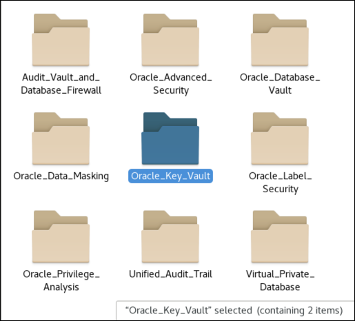

- Select the folder, KV_-_Getting_The_Environment_Ready.  

  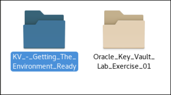

- In the KV_-_Getting_The_Environment_Ready folder, select Start_KV_Infrastructure.sh.  This script will start the infrastructure used in these lab exercises. In these lab exercises, use the Display button to view the contents of the scripts before executing.  This will allow you to review the steps, commands and scripts used in these exercises.  When executing scripts, use the Run in Terminal button.

  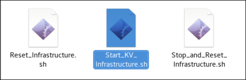

  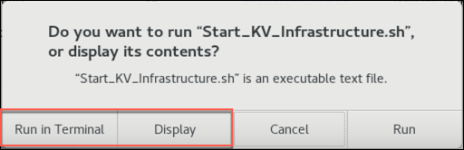

- Please be patient as the infrastructure may take a little time to start.  Once the infrastructure has started, you are ready to move forward with the exercises.

- Within the Oracle_Key_Vault folder, open the folder Oracle_Key_Vault_Lab_Exercise_01. You will see that there are some shell scripts.  
    - Double click 01_okvutil_list.sh and click ‘Display’ to view the script in a terminal window and review what the script will do. 
    - You can now click Run in Terminal which to execute the script.  
    - Once the script has completed, the output will be in the file 01_okvutil_list.out.

  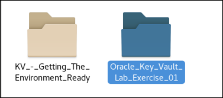

  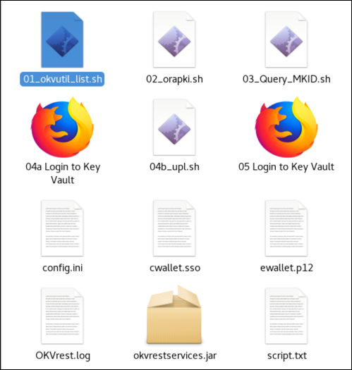

  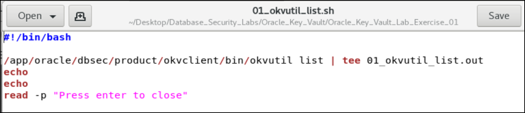

  Below is the result you should see in the terminal window. It shows the current contents of the Key
    Vault which you’ll note is empty except for a Template  file.

    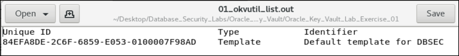

- Now that you have seen the current contents of the Key Vault, use the second script (02_orapki.sh) to show the contents of the Oracle Wallet.  

  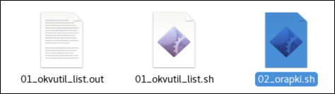

- Review the output from the 02_orapki.sh script. The output should look similar to this:

  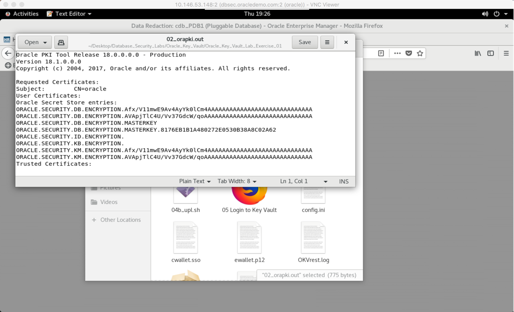

- Execute step 4 (04a Login to Key Vault).  This will bring up the Key Vault administrator console in the web browser.  Login as the KVADMIN user with password Oracle123+.

  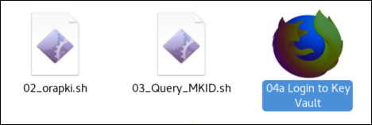

  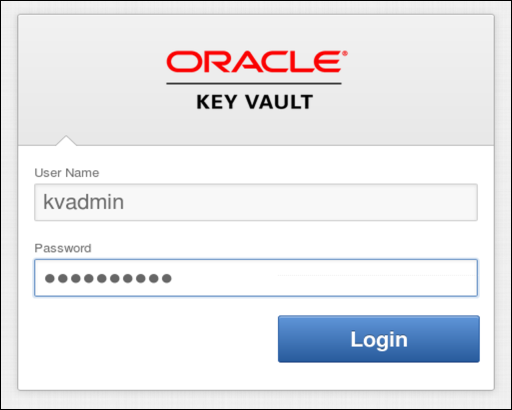

- To begin, navigate to the Keys and Wallets tab and Click the pencil for the cdb wallet.

  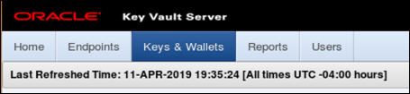

  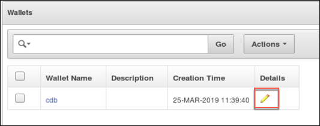

- Notice that the cdb wallet is associated with our DBSEC Endpoint.  The Endpoint has Read, Write, and Manage Wallet access.  

  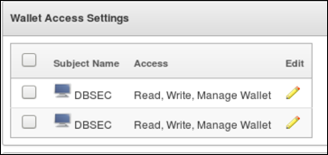

- Click the Endpoints tab and click the Endpoint Name DBSEC

  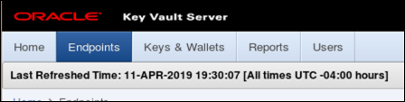

  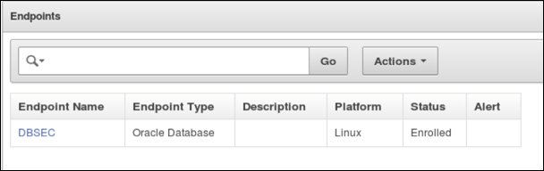

- Notice that the Default Wallet for this Endpoint is cdb. This is where all of the objects we upload from this Endpiont will be stored. 

  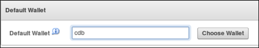

- As you saw in an earlier step, our virtual wallet in OKV contains only a default template file. Our next step is to upload the contents of the local Wallet (on the db host) into the Key Vault by returning to the Oracle_Key_Vault_Lab_Exercise_01 folder and executing the 04b_upl.sh script. 

  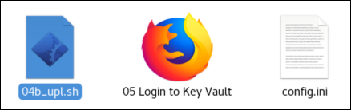

  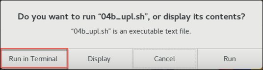

  When prompted for passwords, enter Oracle123 for both the source wallet password and the Oracle Key Vault endpoint password. If you do not get prompted for the Endpoint Password, this is ok. Once that is completed, the results are as follows:

  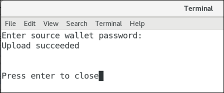

- To see that the local wallet contents have been uploaded, return to the Key Vault console and select the Keys & Wallets tab at the top of the page. Check the wallet and click the Details icon.  Scroll down and note the MKIDs for the available TDE Master Keys. 

  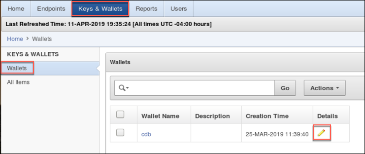

  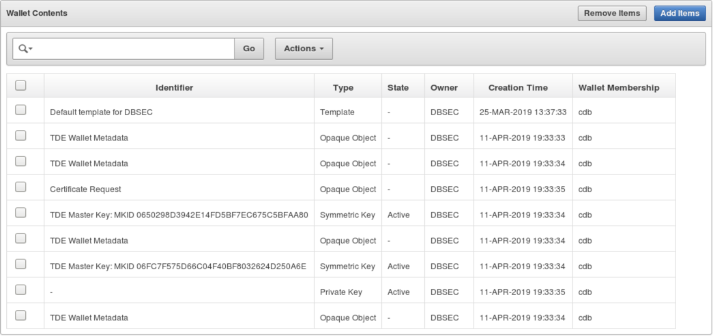

- Go back to the KV lab folder containing the scripts and double click the 03_Query_MKID.sh file

  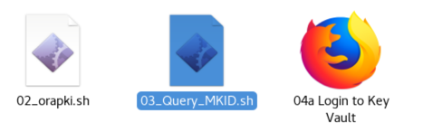

- Review the script output and note the MKID used to encrypt our EMPLOYEESEARCH_DATA tablespace

  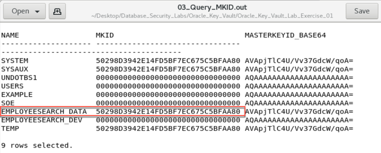

- Return to the KV UI 
- Click Wallets & Keys tab
- Click All Items
- Identify the Master Key based on the output from 03_Query_MKID.sh and the MASTERKEYID_BASE64 column

- Click the pencil icon to get to the details on the Master Key

  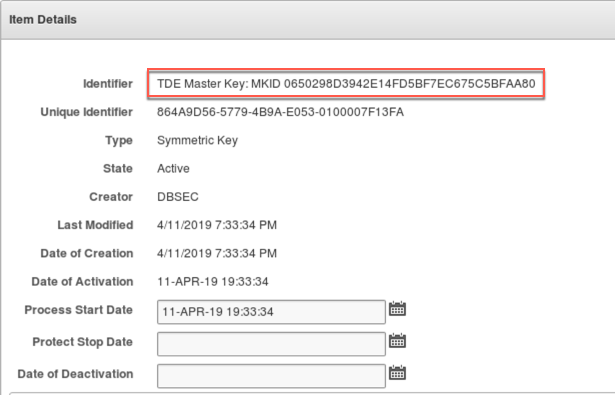

**Conslusion**
- You accomplished the following in this lab
  - Identified the default wallet for our DBSEC endpoint in OKV
  - Uploaded the wallet contents from the local wallet on the DB host to the virtual wallet in KV
  - Matched the MKIDs of the local wallet with those now available in OKV

**This completes the Lab!**
