# Database Security Workshop: Oracle Key Vault

#### Overview

-In this lab exercise, you will accomplish the following:
 - View TDE Wallet and Masterkey in Enterprise Manager
 - Migrate an existing local wallet to Online Master Key
 - Perform a TDE Key Rotation with Online Master Key

### LAB EXERCISE 200: TDE ONLINE MASTER KEY

- Open Enterprise Manager in Firefox

    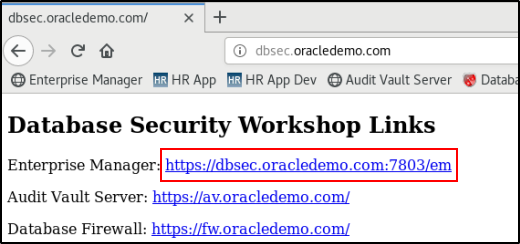

- Login to EM as SYSMAN / Oracle123

    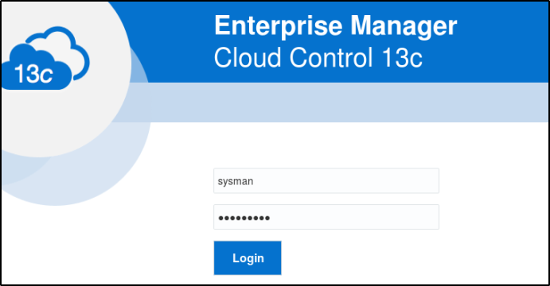

- Navigate to the database cdb - container database

    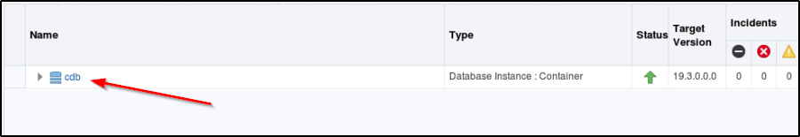

- On the CDB information page, click the Security dropdown then click Transparent Data Encryption

    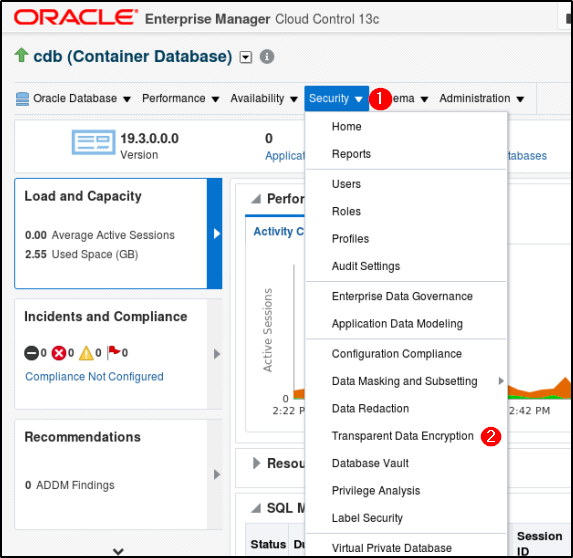

- Using the existing saved credentials, login to cdb as SYS

    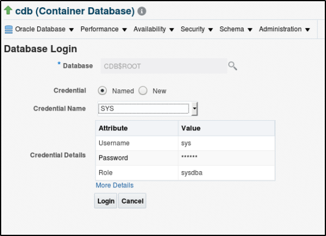

- You may be prompted to set the identifier

    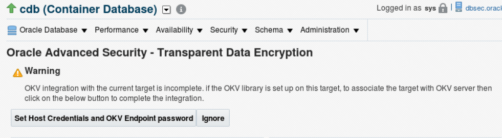
    
- Under **Keystore and Master Keys** click **More** and choose **OKV Integration Setup**

    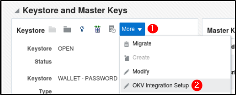

- Choose **OS_ORACLE** as the Host Credentials
- Set the **OKV Library Path** to

        /app/oracle/dbsec/product/okvclient/bin
        
- Set the **OKV Wallet Group** to 
 
       cdb

- Set the **OKV Endpoint Password** to 
 
       Oracle123

- Your screen will look like this
   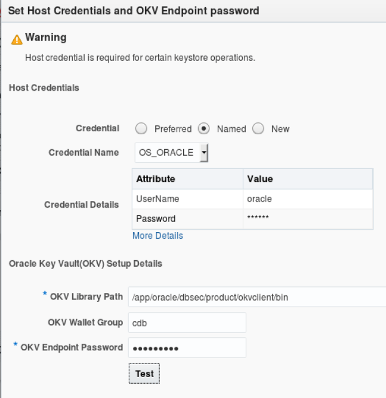

- Test the Integration
    - You should see a "Test successful" message
    - Click OK to acknowledge successful test
    - Click OK to close the integration setup screen

- In the Keystore and Master Keys section of the page, click More, then click Migrate

    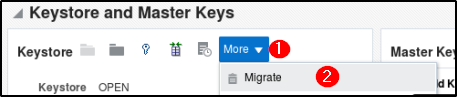
    
- This will open the Migrate Keystore screen
        - If necessary, select OS_ORACLE as your Named Credential

    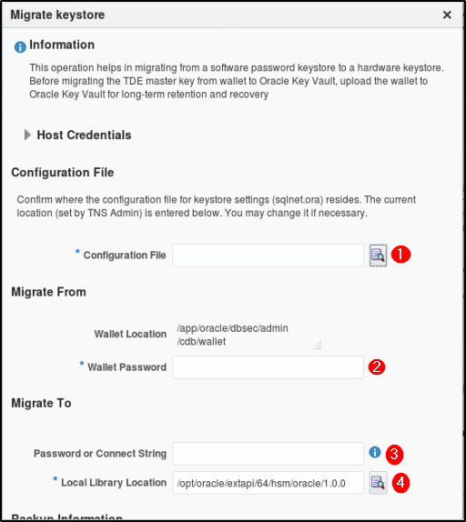
    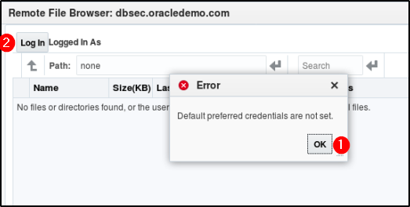

- Set your migrate keystore variables to look like this

       Configuration File: /app/oracle/dbsec/product/19.0.0/dbhome_1/network/admin
       Wallet Location: /app/oracle/dbsec/admin/cdb/wallet
       Wallet Password: Oracle123
       Password or Connect String: null (type the string "null" in the space provided)
       Local Library Location: /opt/oracle/extapi/64/hsm/oracle/1.0.0

    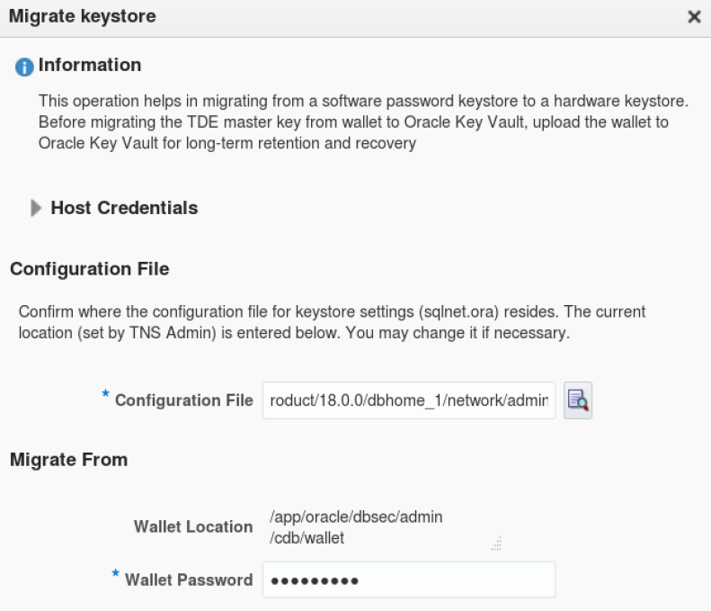       
    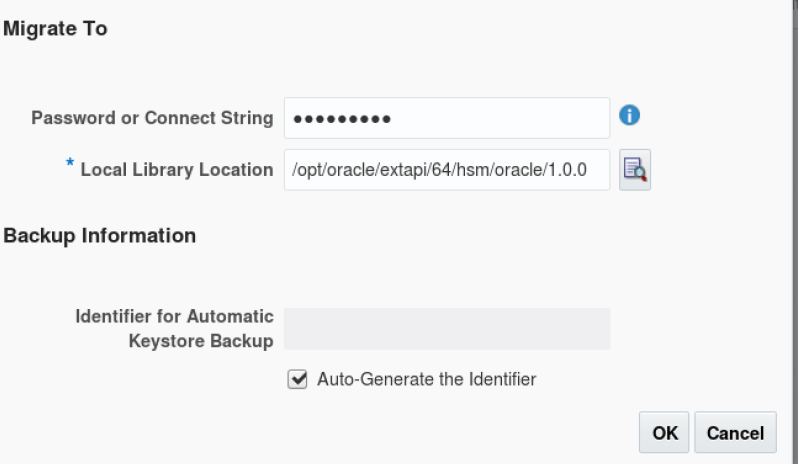

- Once you have confirmed you settings match settings detailed above, click OK to complete the migration.

- Once the migration is completed, you may get prompted to login to the cdb again. If so, login as *SYS*
        - If the browser has moved you to **pdb1** navigate back to **cdb**

- You should see the Keystore say:

        OKV - OKV

- Perform a key rotation by clicking *Rekey* in the Master Keys section of the page

        Password or Connect String: null
        Key Description: Test rekey
            
    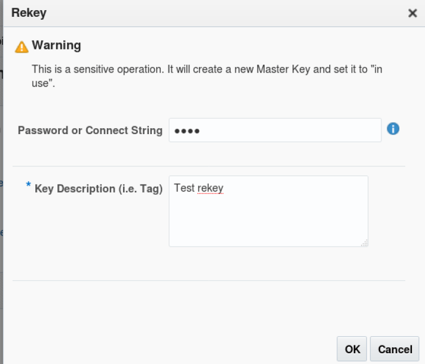
    

- Confirm you want to perform the key rotation
    - Select on **All Containers**

## Remove the local wallet files

- From the terminal, perform the following commands

        cd $ORACLE_BASE/admin/cdb/wallet
        mkdir old_wallets
        mv *.* old_wallets

- Restart the database
    - you may see some errors opening the wallets when you run the start script; in this lab environment, this is expected and can be ignored (as long as the sql query in the next step is successful)

            $HOME/scripts/stop_cdb.sh
    
            $HOME/scripts/start_cdb.sh
        
- Login to the database and issue the following queries

        sqlplus system/Oracle123@pdb1
        select count(*) from employeesearch.demo_hr_users;
        
## Conclusion

This lab has demonstrated migrating the Transparent Data Encryption wallet from a local file on the database server to Oracle Key Vault, using **Online Master Key**.

    
**This completes the Lab!**

- [Database Security Workshop Landing Page](https://github.com/kwazulu/dbsec-workshop/blob/master/README.md)
