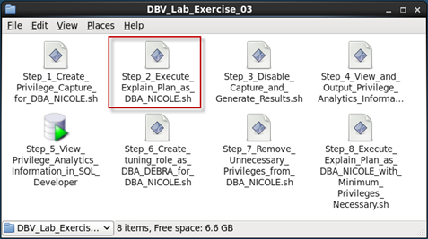
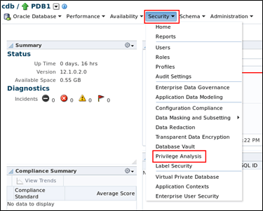

# Database Security Workshop: Privilege Analysis

## Introduction

This is the one of several labs which are part of **Oracle Database Security Workshop.** This workshop will walk you through the process configuring, validating and using all of Oracle's Database Security products

# Getting Started

***To log issues***, click here to go to the [github oracle](https://github.com/kwazulu/dbsec-workshop/issues/new) repository issue submission form.

## Required Artifacts

- The following lab requires:
  - Laptop (Windows, Mac or Linux)
  - Internet Access
  - Oracle VPN/SSL Array Connectivity
  - VNC

##	Here is a summary of the users used in these labs.
  -	SYS / Oracle123     – User with DBA Rights
  - DBA_DEBRA / Oracle123 – Sr. Database Administrator
  - DBA_NICOLE  / Oracle123 – Jr. Database Administrator
  - EMPLOYEESEARCH / Oracle123 - Application Owner

###	OS Accounts and Passwords
  -	oracle / Oracle123
  - root / Oracle123

###	If accessing via VNC
 - :2 (5702) - oracle / Oracle123
 - :1 (5701) - root / Oracle123

## LAB EXERCISE 100 – USING PRIVILEGED ANALYSIS TO DETERMINE LEAST PRIVILEGE ACCESS

Access the lab exercise folders to begin.  On the desktop, navigate to the Database_Security_Workshop folder, double-click and open the contents.

- Select the folder, Privilege_Analysis

    ***In these lab exercises***, use the Display button to view the contents of the scripts before executing.  This will allow you to review the steps, commands and scripts used in these exercises.  When executing scripts, use the Run in Terminal button.

- Once the infrastructure has started, you are ready to move forward with the exercises.

- Does DBA_NICOLE have too many privileges necessary to perform her job?  To find out, DBA_DEBRA creates a privilege capture intended to analyze the privileges of DBA_NICOLE. To perform this step as DBA_DEBRA, click the icon Step_1_Create_Privilege_Capture_for_DBA_NICOLE.sh.

- Click Step_01_Create_Privilege_Capture_for_DBA_NICOLE.out to view the output of the script.

- With the capture in place, DBA_NICOLE performs the common tasks that she is responsible for.  For the requirements of this lab, the capture duration is much less than would be needed in a production environment. To perform this step as DBA_NICOLE, click the icon Step_2_Execute_Explain_Plan_as_DBA_NICOLE.sh.

    
    
- Click Step_2_Generate_Workload.out to view the output of the script.

- After a period of time, DBA_DEBRA would stop the privilege analytics capture process and generate the results to review.  Click the icon Step_3_Disable_Capture_and_Generate_Results.sh. to perform these actions as DBA_DEBRA.

- Click Step_03_Disable_Capture_and_Generate_Results.out to view the output of the script.

- DBA_DEBRA would start the analysis of the privilege analytics information by viewing the results.  First, you will execute a query to view the results.  Click the icon Step_4_View_and_Output_Privilege_Analytics_Information_as_DBA_DEBRA.sh to execute a query to view the results as DBA_DEBRA.  

- Click Step_04_View_PA_Output.out to view the output of the scripts.

- Since the capture was specifically for DBA_NICOLE, these are SYS_PRIV and OBJ_PRIV necessary to complete the operations during the capture process.

- If you wish, you can examine the information that DBA_DEBRA would see in Enterprise Manager.  Click the icon Step_5_View_PA_in_Enterprise_Manager.

- Login to Enterprise Manager as SYSMAN / Oracle123

- Login to PDB1 as DBA_DEBRA

- Click the Security tab and click Privilege Analysis

      
    
- Based upon the information collected and other information available, DBA_DEBRA determined that DBA_NICOLE has too many privileges necessary to do her job.  To remediate this, DBA_DEBRA creates a specific tuning role DBA_TUNING_ROLE with the least privileges necessary to perform DBA_NICOLE's tasks. Click the icon Step_6_Create_tuning_role_as_DBA_DEBRA_for_DBA_NICOLE.sh to create this role as DBA_DEBRA.

- Click Step_06_Create_tuning_role_for_DBA_NICOLE.out to view the output of the scripts.

- Click the icon Step_7_Remove_Unused_Privileges_from_DBA_NICOLE.sh.   You will remove all of the unnecessary (elevated) privileges of DBA_NICOLE, GRANT the minimum necessary privileges identified in your capture process to the DBA_TUNING_ROLE, and grant DBA_TUNING_ROLE to DBA_NICOLE.   

- Click the Step_07_Remove_Unused_Privileges_from_DBA_NICOLE.out to view the output of the scripts.

***Note:***  Since Database Vault is enabled on this database, DBV_ACCTMGR_PDB1 is the designated user for account management functions.

- Re-execute the tuning operations as DBA_NICOLE to ensure she has the necessary privileges to perform her job.  Click the icon Step_8_Execute_Explain_Plan_as_DBA_NICOLE_with_Minimum_Privileges_Necessary.sh

- Click Step_8_Execute_Explain_Plan_as_DBA_NICOLE_with_Minimum_Privileges_Necessary.out to view the output of the scripts.

#### Conclusion

In this lab, you have used privilege analysis to identify used and unused privileges. 

**This completes this Lab!**

--- 

[Privilege Analysis Landing Page](../README.md)

[Database Security Workshop Landing Page](https://github.com/kwazulu/dbsec-workshop/blob/master/README.md)
