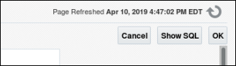

# Database Security Workshop: Advanced Security - Data Redaction
## Introduction

This one of several labs which are part of **Oracle Database Security Workshop.** This workshop will walk you through the process configuring, validating and using all of Oracle's Database Security products

Oracle Advanced Security comprises two security features to protect sensitive database data. The first feature is Transparent Data Encryption (TDE) which encrypts data "at rest", the second is Data Redaction. Oracle Data Redaction enables you to mask (redact) data that is returned from queries issued by applications. Oracle Database applies the redaction at runtime, when users access the data (that is, at query-execution time). This solution works well in a production system. During the time that the data is being redacted, all of the data processing is performed normally, and the back-end referential integrity constraints are preserved.

Data Redaction can help you to comply with industry regulations such as Payment Card Industry Data Security Standard (PCI DSS) and the Sarbanes-Oxley Act.

***To log issues***, click here to go to the [github oracle](https://github.com/oracle/learning-library/issues/new) repository issue submission form.

## Required Artifacts

- The following lab requires:
  - Laptop (Windows, Mac or Linux)
  - VNC client

### PROTECTION OF SENSITIVE DATA IN APPLICATIONS USING ORACLE DATABASE DATA REDACTION 

Oracle Data Redaction enables you to move redaction capabilities out of applications and into the database. It provides an easy way to protect sensitive information that is displayed in applications by replacing it on-the-fly with valid redacted data, while keeping the applications running. Sensitive information is concealed according to flexible polices that provide conditional redaction and that are managed directly within the database. For maximum transparency, redaction preserves the type and formatting of column data returned to applications, and it does not alter the underlying database blocks on disk or in cache. Oracle Data Redaction is designed to be fast so that it can run on production systems. In addition, it is embedded in the database, so no separate installation is required.

Oracle Data Redaction enables you to mask (redact) data that is returned from queries issued by low-privileged users or applications. 

#### Overview

In this lab exercise, you will accomplish the following:
- Create simple redaction policy
- Use redaction templates to define policies for full/partial redaction
- Verify that redaction applies transparently across all applications

#### Setup and preparation

- On the Oracle Linux Desktop, navigate to the Database_Security_Labs folder. 

  

- Select the folder, Oracle_Advanced_Security.

  

- Select the folder, Oracle_Advanced_Security_Lab_Exercise_02.

   

  Note: Oracle Advanced Security Lab_Exercise_01 contains Transparent Data Encryption exercises, covered in the first section of this workbook.

  You are ready to move forward to the Data Redaction lab exercise.

#### Oracle Advanced Security: Redaction

- In the Lab_Exercise_02_Advanced_Security folder, double-click the icon HR Application - Production icon to launch Firefox.
 
   

- Click Login and use the following credentials: hradmin/Oracle123 and click Login button to continue.

   

- Click Search Employees and then click Search to return all of the rows

   

  

- Click on Adams, Cynthia, and view her HR details.  Notice you can see her full Social Security Number, Social Identification Number, or National Identifier, as well as Corporate Card information and Supplemental Data such as Last Insurance Claim, Routing Number, and Bonus Amount. 

  

   

- You could implement controls within each application that uses this HR data, but instead, you will create a Data Redaction policy enforced at the database layer to restrict the visibility and access to this information by ANY application

  Open a new tab in your browser and select the Enterprise Manager Cloud Control shortcut to access the Enterprise Manager console to administer Data Redaction.   

  

  Login to the Enterprise Manager – Cloud Control application using the following credentials sysman/Oracle123.

  

- On the Database Targets page, drill down to cdb_PDB1 and click it.

    

- On the cdb_PDB1 information page, select the menu option Security then Data Redaction.

         

- You may be prompted for database login credentials.  Here you should connect using the Named Credential for SYS to connect to PDB1.

      

- You will be taken to the Data Redaction overview page where you can create a new Data Redaction policy.  Click the highlighted Create button. 

      

- In the Create Data Redaction Policy screen, click the magnifier glass icon to search for the EMPLOYEESEARCH schema.

      

- Choose DEMO_HR_EMPLOYEES as the table to Redact

      

- For the Policy Name field, enter REDACT_EMP_DATA. Confirm that the Policy Expression is ‘1=1’.  This Redaction Policy Expression defaults to 1=1 (TRUE), meaning to always redact.

     

- Now define the columns to be redacted.  Click the Add button. 

       

- In the Add column dialogue, choose the Column, NINO and set the Sensitive Column Type to NINO and Redaction Function (FULL) at their default values.  Click the OK button to continue.

      

- After adding the NINO column to the Data Redaction Policy, click the Add button to add SIN, SSN and CORPORATE_CARD with the parameters you see below.  

        Sensitive Column Type: SOCIAL_INSURANCE_NUMBER
        Expression Name: Default Expression
        Redaction Format: Canadian Social Insurance Numbers - Formatted
    
     **Note:** The **Redaction Format** input will be automatically filled out as **PARTIAL**  
    
        

- Add the SSN column 

        Sensitive Column Type: SOCIAL_SECURITY_NUMBER
        Expression Name: Default Expression
        Redaction Format: U.S. Social Security Numbers - Formatted
       
     **Note:** The **Redaction Format** input will be automatically filled out as **PARTIAL**  
     
    
    
- Add the CORPORATE_CARD column   

        Sensitive Column Type: CREDIT_CARD_NUMBER
        Expression Name: Default Expression
        Redaction Format: Credit Card Numbers - Pratially Redacted
       
     **Note:** The **Redaction Format** input will be automatically filled out as **PARTIAL** and you do not need to complete the **Functional Attributes**
     
    

- You should see the following 4 object columns. Click OK once you have confirmed all four columns have been configured.

    

- Navigate back to the HR Application in your browser and look at a few of the employee records and notice how they are being redacted. They should look something like the screenshots below. If they do not look like this, you may have an error in your Redaction configuration.

     
    
     
    
      

- At the moment, this Redaction policy will be enforced globally, regardless of where the connection to the database originates from.
 Redaction policies are rarely enforced globally, however.  If data is being stored, someone needs to be able to see that data.  These policies are generally enforced based on job role, session information, or some other environmental condition.

  Lets modify our Redaction policy such that users connecting through the HR Application will be exempt from the policy and thus see all data. 

  Navigate back to Enterprise Manager and click Edit to make modifications to our policy.

- Click the pencil icon next to the Default Expression box

  

- On the Expression screen, add the following expression to make JDBC connections exempt from the policy (HR Application uses JDBC to connect to the database)

        SYS_CONTEXT('USERENV','MODULE') != 'JDBC Thin Client'
        OR SYS_CONTEXT('USERENV','MODULE') is null

  

- Click ok to save policy changes

  

- Return to the MY HR Application Browser window and refresh the page.  You should now see data is no longer being redacted.

   

- From the lab Folder, double-click the `Query_Redacted_Data.sh` to see the output

    

- View the Script Output and identify the redacted data

    

- 

 #### Conclusion

 As data exposed in applications continues to rapidly expand, enterprises must have strong controls in place to protect data no matter what devices or applications are used. Oracle Database helps organizations keep their sensitive information safe in this increasingly complex environment by delivering preventive, detective and administrative controls that enforce data security in the database. Oracle Advanced Security with Oracle Database provides two critical preventive controls.

Transparent Data Encryption encrypts data at rest to stop database bypass attacks from accessing sensitive information in storage. Data Redaction reduces exposure of sensitive information in applications by redacting database query results on-the-fly, according to defined policies. Together these two controls form the foundation of a multi-layered, defense-in-depth approach, and further establish Oracle Database as the world’s most advanced database security solution.

**This completes the Lab!**

- [Database Security Workshop Landing Page](https://github.com/kwazulu/dbsec-workshop/blob/master/README.md)
